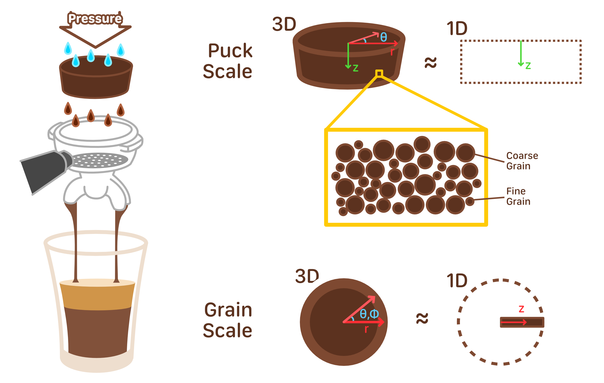
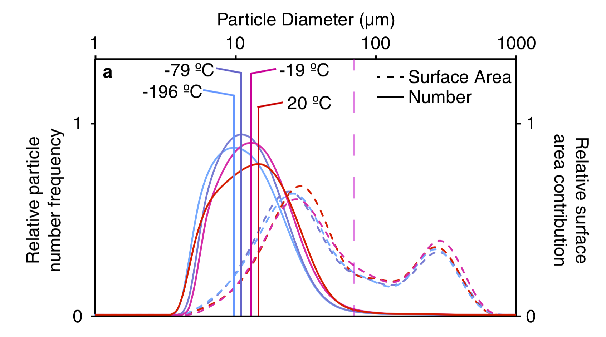

# Motivation(-ish)

I am by no means an expert on making or tasting coffee -- not a great start for this post! 
As an excitable nerdy researcher,
I resorted to using coffee as a means of fueling myself up. After spending time in multiple 
offices with other researchers, brewing a cup of espresso became a habit. 
I didn't really ever care for its taste beyond the "*shake-y* feeling" it provides, afterall,
I never had to brew a good cup of espresso if my drink had a generous serving of milk and sugar added.

After brewing an unexpectedly delicious cup of espresso at my office one morning, 
I couldn't help but wonder what could've changed to make this cup so much
better. I had used the same beans as any other day and proceeded with my usual espresso
brewing habit: use the same "parameters" as the previous person. Figuring out what could've changed
cemented my descend into madness.

This post is my attempt to organize my madness and talk about a Julia package I implemented inspired by 
the [various literature](#references) (especially [\[1\]](#references) for the model formulation) I ended up reading to simulate 
espresso brewing.

As an espresso novice who didn't know what the word tamp meant two weeks ago, I
realized I had to learn at least a few coffee brewing concepts to improve my
morning coffee ritual. I find it hard to trust random phenomenological advice that isn't 
backed by systematic/theoretic evidence. While the body of experimental and intuitive
knowledge on coffee extraction is broad, I ultimately decided to try to write my own simulator for 
coffee preparation -- I did say I went mad. This served as a means for me to be able to explore various
parameter regimes and have a deeper understanding of why people give various tidbits of advice,
things like: "the finer the grind, the more bitter the coffee is" or "the slower the flow, 
the more extraction there is."

> **Actual Motivation?**
> 
> Well, it also seemed natural to have an espresso simulator to complement my
> **baking simulator** (posts to come on this at some point 😀). 
> I may be fueling my escapist simulation-based bakery/café dream too much,
> but a person can only dream.

<!-- ## Previous work -->

<!-- I read a few articles that inspired this work, including using the formulation
for the homogenization problem as defined in [\[1\]](#references). -->

<!-- **[TODO]** -->

# Coffee Extraction

When making a cup of espresso, you can typically play with 2 classes of parameters:

1. Parameters of the Espresso Machine
   - Pressure
   - Grind size
   - Temperature of the Water
   - Preinfusion time
   - Brew time
2. Puck preparation
   - Tamping pressure
   - Number of clumps
   - Grain size and position distributions
   - Temperature of the puck
   - Pre-emptive planning for flow optimization

The things that differ in the output fall in 3 classes:

1. The good stuff: the flavors, aromas, maillard reaction products (from roasting)...
2. The shake-y stuff: the caffeine
3. The bad stuff: the bitter stuff, tannins

These different classes (and subclasses) have different characteristic extraction timescales
which is what optimized brewing takes advantage of. The ratio of all these (sub)classes is what
makes the ideal cup of espresso for a certain person - and just like with food, different latent
parameter regimes correspond to different favorability for a group of people.

I will focus on solving the problem of predictively simulating the resultant latent parameter regimes, 
all of which have extensive ways to be measured after a cup is brewed. The decision of the optimal cup
flavor profile is then dependent on the type of bean, the level of the roast, ..., and most importantly
the barista's preferences.


## Coffee Transport

When dealing with factors regarding espresso extraction, we are concerned with the 
transport of "coffee molecules" into the liquid drink. This extraction is a function
of parameters across multiple different scales.



We will be thinking about two main order of magnitudes of scales: the puck scale and 
the grain scale. 

At the puck scale, we will be concerning ourselves with a 1D reduction
of the cylindrical coordinate system of a double-shot-sized basket (these baskets have a
non-tapered profile but modifying the mass-matrices to handle non-uniform radius baskets
would be trivial). If we were to model the basket as a cylinder with constant pressure water
being applied above the basket, we can see that the angular component of the coordinate 
system is redundant due to the rotational symmetry of the basket. We can also take advantage of
the fact that (a) the primary mechanism of coffee extraction is advection [insert reference here]()
and (b) the flow regime in typical espresso brewing applications contains mostly local 
interactions independent on the radial position [insert reference here also](). We can therefore
drop the dimension along the radius and angle of the puck and average across them in our simulations.

At the grain scale, we are concerned with modelling the individual grains inside our 1D-reduced basket
to model how our "coffee molecules" are being extracted from within the grain into our liquid beverage.
We will be modelling this using a reduced 1D model as well such that we can drop the dependence of our
Differential Algebraic Equations (DAEs) on the two angular dimensions of a spherical coordinate system.

We will therefore end up with an equivalent multi-scale 2D model for an espresso puck where each dimension
concerns different scales ($\mathrm{cm}$ for the puck scale vs.  $\mathrm{\mu m}$ for the grain scale).


## Extraction Snobbery

<center>
<figure>
   
  <figcaption>Figure from Uman et al. <a href="#references">[3]</a> showcasing the dependence of the grind distribution on temperature.
  The grind size typically features two peaks and the underlying surface area distribution directly effects
  the extraction quality <a href="#references">[4]</a>. This is typically the reason espresso connoisseurs chase high-end grinders for beans <a href="#references">[4]</a>.
  </figcaption>
</figure>
</center>

- add fig of coffee grind size spectrum

# TODO: baskets

- add blurb on precision baskets
- how to generaliz eemodel to bad baskets
- add pressure out from baskets -> basket size effects output pressure
- blurb on pressure chambered baskets for ground coffee https://www.youtube.com/watch?v=3oFV88PzEFE
- single shot baskets are harder to prep and make consistent. removal of z-symmetry
- smaller puck offers less resistance to water flow, so you need to grind finer to maintain extraction time

# Multi-Scale Homogenized Advection-Diffusion Setup

**TODO**: Multi-scale solving, cite papers etc.

## A Multi-Scale Problem


### Advection-Diffusion


### Mass-Matrices


- our mass matrix is singular (rank is always $2N^2$ and dim is always $2N^2+N$)
- Convinient way to write a DAE
- Finite differences -> tridiagoinal structure
- Boundary Value Problem

## Formalization


Enforcing mass conservation on the homogenised control volume, we find that the mass of coffee
absorbed in the liquid at time $t$ is:

$$
\begin{align}
  M_l(t) &= \pi R^2 \int_0^L (1-\phi_s)c_l(z, t) \; dz
  \newline
  \dfrac{dM_l(t)}{dt} &= \pi R^2 \cdot \left ( 
       \int_0^L D_{eff} \dfrac{\partial c_l(z, t)}{\partial z} + \vec{b}_{et} \cdot \vec{G} \; dz
      \right)
  \newline
  \dfrac{dM_l(t)}{dt} &= \pi R^2 \cdot \left ( 
     -\dfrac{\kappa_{eff} P_{tot}}{\mu L} c_l(z=L, t) + \int_0^L \vec{b}_{et}\cdot \vec{G} \;dz 
     \right)
  \label{eq:mass}
\end{align}
$$

Assuming that at $t=0$, the concentration of coffee in the liquid is 0, we get that $M_l(t=0)=0$,
which implies that

$$
\begin{align}
aaaa
\end{align}
$$

I listed the assumptions that go into this model [here](#assumptions).

## The System of Differential Equations

### System of Differential Algebraic Equations Formulation

A typical differential equation for a state vector $u$ is written as:

$$
   \begin{align}
   \dfrac{du}{dt} = f(t, u)
   %  \label{eq:basicdudt}
 \end{align}
$$

Which describes how the state $u$ evolves as a function of time and its state.
We will be defining a mass-matrix differential equation that has an
extra term $M$:

$$
   \begin{align}
   M \dfrac{du}{dt} = f(t, u)
   %  \label{eq:massdudt}
 \end{align}
$$

In our case, $M$ is sparse, singular and independent of $t$ and $u$, this makes our differential
equation a system of differential algebraic equations (DAEs) of index 1.

<!-- todo add blurb on why and link to https://arxiv.org/pdf/2008.03883 -->

This mass matrix will be set to normalize the spherical diffusion problem... more details and reference code here.

### The Terms

We will first discretize over the size of granules in our puck, typically
(TODO: see figure with two peaks above) this modelling is done with 
two particle sizes - coarse grains and fine grains, but the code is
extensible such that one can in principle add as many grain sizes
as one wishes to model. The model size grows quadratically with this 
number (each grain size adds an $O(N^2)$ terms to the state vector).
We will enumerate over the grain sizes using the name particle size number. We will denote the set of grain sizes $\mathscr{P}$.

We will define the (dimensionless) rate of reaction at any point
in the extraction process as:

$$
   \begin{align}
  G_i = K c_{\text{surf}, i} (1 - c_l) \cdot (c_{\text{surf}, i} - \beta c_l)
  \label{eq:Gi_eq}
 \end{align}
$$

for $i \in \left[1, |\mathscr{P}|\right]$ being a particle size number 
($i\in [1, 2]$ for coarse and fine 
grain sizes) and $c_{\text{surf}, i}$ is the surface concentration of
sollubles in the individual grains. You can notice that the rate of reaction
goes along the gradient of concentration of sollubles in the liquid and the surface
($\sim (1-c_l)c_{surf, i}$), such that the more sollubles that are in the surface
compared to the liquid, the more of it will exit the surface (larger reaction rate).

$\beta = \frac{c_{\text{sat}}}{c_{s0}}$ is a dimensionless parameter that factors in the saturation
concentration of sollubles that can have immediately outside of a grain/in the liquid. Where $c_{s0} \equiv c_{s}\vert_{t=0}$ is the concentration of of coffee sollubles in the grains at time $t=0$. We will also assume that at $t=0$, there
is no coffee in the liquid (preinfusion has not performed any meaningful extraction, only pre-etting the bed), i.e. $c_l\vert _{t=0} = 0$.

$K$ is an inverse mass transfer Biot number that describes the ratio of typical flux of coffee in the solid to that through the liquid/solid interface. This basically describes how much of the liquid undergoing extraction goes into and interacts (amount of flux) with the insides of the grain versus the outside shell of the grain. The dimensional form of $K$ can be calculated as $K = k c_{s0}^2 \tau_{\text{shot}}b_{et, 0}$ for a certain choice of normalization 
Brunauer-Emmett-Teller surface area (TODO: add ref to https://nanoearth.ictas.vt.edu/access/selector/bet.html for more details) (for example, mean of all areas $b_{et, i}$ for $i$ particle size number).

Once we have the reaction rates defined, we can write down our reaction-advection-diffusion equation in terms of the darcy flux $\mathbf{q}= - \dfrac{\kappa}{\mu} \nabla P$ and effectve diffusivity ($D_{eff}$) as:

$$
   \begin{align}
   (1-\phi_s) \dfrac{\partial c_l}{\partial t} = \nabla \cdot (D_{eff} \nabla c_l - \mathbf{q} c_l) + \sum_{i=1}^{|\mathscr{P}|} b_{et, i} G_i
    \label{eq:rad_eq}
 \end{align}
$$

This equation is a generalized equation of 
(TODO: insert ref to orig. paper)
from the form of (TODO: insert ref to Multiscale modelling and analysis of lithiumion battery charge and discharge).

TODO:

$\phi_s = \sum_{i=1}^{|\mathscr{P}|} \phi_{s, i}$ is the local volume fraction of coffee where for each particle size index, we can calculate the individual 
local volume fraction using the Brunauer-Emmett-Teller (BET) surface area and radius of the particles $r_i$ as 
$\phi_{s, i} = b_{et, i}\cdot \left(\dfrac{4}{3} \pi r_i^3\right)\cdot (4\pi r_i^2)^{-1}$. Notice that this volume fraction is nothing other than the 
ratio of the volume of a sphere to the surface area of a sphere times the BET surface area.

Due to the symmetry of the puck, we can assume that the darcy flux $\mathbf{q}$
in steady state has only a z-component, i.e. $\mathbf{q} = [0, 0, q_z]^T$. We can
then drop the $q_x$ and $q_y$ terms of the equation and greatly simplify it. This is
equivalent to the 1D reduction we showed in coffee transport figure above. Where the only
puck-length-scale one needs to care about is the z-axis, and therefore, the 3D problem
can be reduced to a 1D component problem.

We also need to consider the backaction dynamics on the grains - as we extract sollubles from them, their
ability to supply new sollubles on the surface is impeded by sollubles having just left it. The spherical grain
will move sollubles from the core outwards across the radius dimension to yield an equation like:

$$
\begin{align}
\dfrac{\partial c_{s, i}}{\partial t} = \dfrac{1}{r_i^2} \dfrac{\partial}{\partial r} \left( r_i^2 D_{s, i}\dfrac{\partial c_{s, i}}{\partial r} \right) \label{eq:sol_diff_eq}
\end{align}
$$

where is the particle size number
($i \in [1, |\mathscr{P}|]$) as above. 
With boundary conditions:

$$
\begin{align}
-D_{s, i} \dfrac{\partial c_{s, i}}{\partial t} \bigg \vert _{r_i = 0} = 0 \;\; \text{and} \nonumber \\
-D_{s, i} \dfrac{\partial c_{s, i}}{\partial t} \bigg \vert _{r_i = r_i} = \beta \dfrac{1}{r_i b_{et, 0}} G_i \;\;  \label{eq:sol_diff_eq_cond}
\end{align}
$$

TODO: differentiate between $r_i$ and $r_i$ variable and grain radius.... ughhhhhhhh....

TODO: add finite defintion of $G_i$ since this is used for teh equation and is a function of $r_i$

<!-- TODO: Three parameters, namely Def f , Ds and k, remain -->

For the code, we will define a finite difference formulation of equation $\ref{eq:rad_eq}$ including boundary conditions,
homogenization and the dimension simplifications to get:

$$
\begin{align}
   \delta_t c_l[1] &= q_z c_l[1] + D_{\text{eff}} \cdot \dfrac{\frac{1}{2}c_l[3] - 2c_l[2] + \frac{3}{2}c_l[1] }{dz} \label{eq:finite_diff_rad_eq_1} \\

   \delta_t c_l[2:N_z-1] &= \dfrac{1}{(1-\phi_s)} \cdot \bigg ( \\
      &- q_z \cdot \dfrac{c_l[3:N_z] - c_l[1:N_z-2]}{2dz}\nonumber \\
      &+ D_{\text{eff}} \cdot \dfrac{c_l[3:N_z] - c_l[2:N_z-1] + c_l[1:N_z-2]}{dz^2}\nonumber \\
      &+ \sum_{i=1}^{|\mathscr{P}|} b_{et, i} G_i[2:N_z-1] \nonumber\\
   \bigg ) \nonumber \\ % \label{eq:finite_diff_rad_eq}

   \delta_t c_l[N_z] &= \frac{1}{2}c_l[N_z-2] - 2c_k[N_z-1] + \frac{3}{2} c_k[N_z]
   
   \label{eq:finite_diff_rad_eq_2}


 \end{align}
$$

Equations \ref{eq:finite_diff_rad_eq_1}-\ref{eq:finite_diff_rad_eq_2} describe the dynamics of extraction in the liquid phase,
however, we must also update the state vector of the grains to account for sollubles having left the various shells. We will 
update the $|\mathscr{P}| \times N_r \times N_z$ 
matrices (there are $|\mathscr{P}|$ independent 
matrices of size $N_r \times N_z$ whose dynamics are set by 
differential operators along $N_r$) to derive a system of differential equation that 
correspond to every particle size number in the same manner
as the continuous variant in \ref{eq:sol_diff_eq}-\ref{eq:sol_diff_eq_cond}. For every
$i \in [1, |\mathscr{P}|]$:

$$
\begin{align}
   \delta_t c_{s, i}[1, :] &= \Delta_i \label{eq:finite_diff_sol_eq_1}\\

   \delta_t c_{s, i}[2:N_r-1, :] &=  \Delta_i[2:N_r] - \Delta_i[1:N_r-1] \\ % \label{eq:finite_diff_rad_eq}

   \delta_t c_{s, i}[N_r, :] &= - \Delta_i[N_r] - 4\pi \beta \dfrac{1}{r_i b_{et, 0}} G_i

 \end{align}
$$

Where $\Delta_i$ describes the signed instantaneous flux of coffee sollubles from shell $j$ to $j+1$ where $j\in [1, N_r-1]$:

$$
\begin{align}
   \Delta_i &= 4\pi D_{s, i} \left(\frac{1}{2} \vec R[2:N_r] + \frac{1}{2} \vec R[1:N_r-1] \right)^2 \nonumber\\
   &\times \dfrac{c_{s, i}[2:N_r, 1:N_z] - c_{s, i}[1:N_r-1, 1:N_z]}{dr} \label{eq:finite_diff_sol_eq_2}\\
\end{align}
$$

The above equations \ref{eq:finite_diff_sol_eq_1}-\ref{eq:finite_diff_sol_eq_2} describe the advection-diffusion outside
the various shells of the grain "spheres," where the dynamics is independent of the $z$-axis. Notice how the second index 
for each matrix, along $N_z$ see the same equation, the parameteric equations and boundary conditions only apply on $z$ due
to the symmetry we identified in the coffee transport figure above reducing the grain dimensions to 1D, independent of the
puck-length-scale problem.

## Solving the ODE

> **TODO**: 
> 
> - ODE Definition

Using Julia's `DifferentialEquations.jl`{:.highlight .language-julia} package we can setup
a mass-matrix ODE to compute the flow of coffee sollubles similar to [**TODOTODOTODO**]().

- cite https://arxiv.org/pdf/2008.03883
- Rosenbrok23 p good - fast and high accuracy see above link.
- Rodas5P - A 5th order A-stable stiffly stable Rosenbrock method with a stiff-aware 4th order interpolant. Has improved stability in the adaptive time stepping embedding.
- Factor of 10 faster than default choice from DifferentialEquations.jl <- its important to know when to swap solvers :)
- list of solvers: https://docs.sciml.ai/OrdinaryDiffEq/stable/massmatrixdae/Rosenbrock/#OrdinaryDiffEqRosenbrock.Rosenbrock23-massmatrixdae-Rosenbrock


## The Julia Package

<center>
<figure>
  
  <figcaption>Logo of the EspressoSimulations.jl package <a href="#references">[0]</a>.
  </figcaption>
</figure>
</center>

Instructions on installing the package:
```
```

Basic use:
```
```

## Assumptions

- Incompressible flow, following reference [\[2\]](#references)
- Constant viscosity, following reference [\[2\]](#references)
- At $t=0$, wetting and pre-infusion stages are completed and the bed is filled with water, following reference [\[1\]](#references)
  - As a result, the flow is steady
  - Assume homogeneous flow where the two-phase flow is comprised of two well-mixed phases.
- At $t=0$, all of the coffee concentration is in the solids, none has diffused into the liquid yet
- Assuming radial symmetry within the puck, following reference [\[1\]](#references)
- Rate of transfer of coffee solubles is a local operator on top of the concentration field.
- The puck is treated isothermally
- Two distribution of particle sizes have dominant frequencies, following experimental evidence from **TODO**
- Static puck, i.e. parameters held constant are:
  - Diffusivity
  - Grain surface areas
  - Puck height
  - Puck geometry only depends on initial grind settings
  - Density of drink equal to density of water [**TODO: change this??**]

# References

TODOTODOTODOTODOTODOTODO

0. Github link to package (update this 1 later)
1. M. I. Cameron et al., “[Systematically Improving Espresso: Insights from Mathematical Modeling and Experiment](https://doi.org/10.1016/j.matt.2019.12.019),” Matter, vol. 2, no. 3, pp. 631–648, 2020.
2. K. M. Moroney, W. T. Lee, S. B. G. O׳Brien, F. Suijver, and J. Marra, “[Modelling of coffee extraction during brewing using multiscale methods: An experimentally validated model](https://doi.org/10.1016/j.ces.2015.06.003),” Chemical Engineering Science, vol. 137, pp. 216–234, 2015.
3. Uman, E., Colonna-Dashwood, M., Colonna-Dashwood, L. et al. [The effect of bean origin and temperature on grinding roasted coffee](https://www.nature.com/articles/srep24483). Sci Rep 6, 24483 (2016). https://doi.org/10.1038/srep24483
4. Hoffman, J., [The Best Espresso Grinder Under £250](https://www.youtube.com/watch?v=G7xGhGtvYIs&t=1104s). YouTube (2024).
5. Zeng control volume method (2013 MIT DSPace) for:
