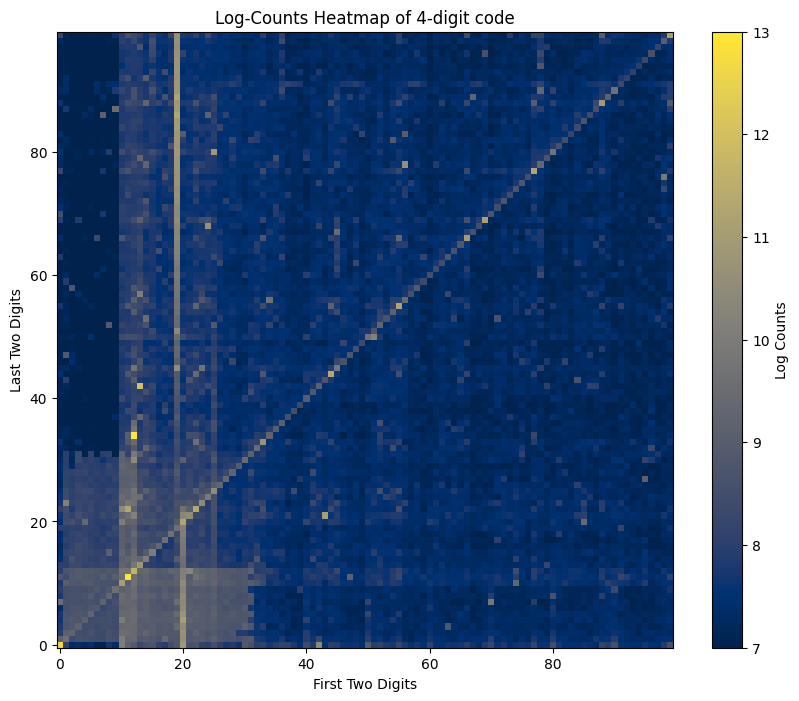
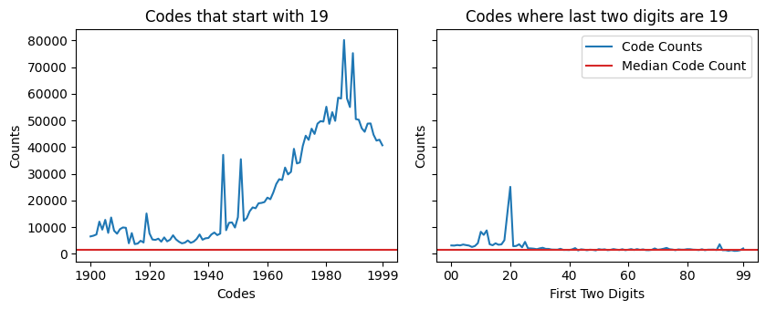
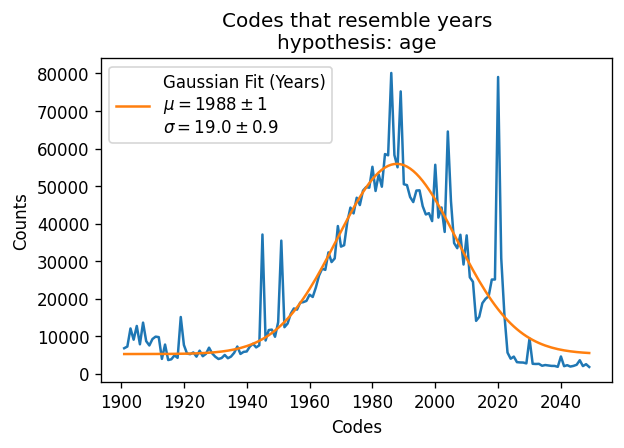
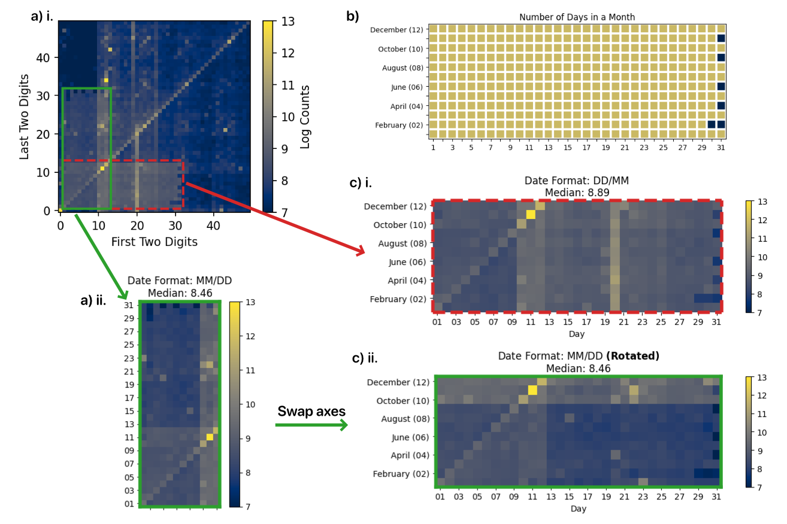
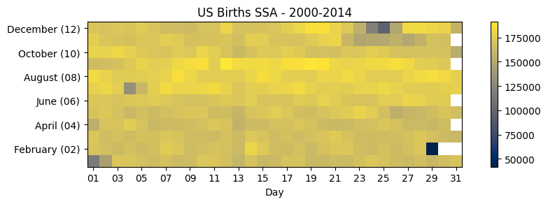
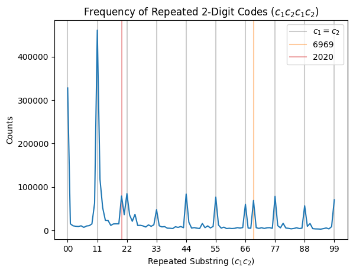
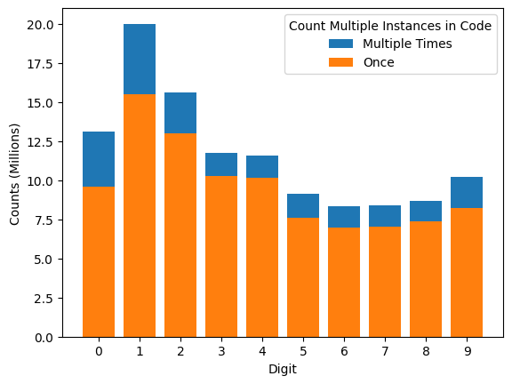
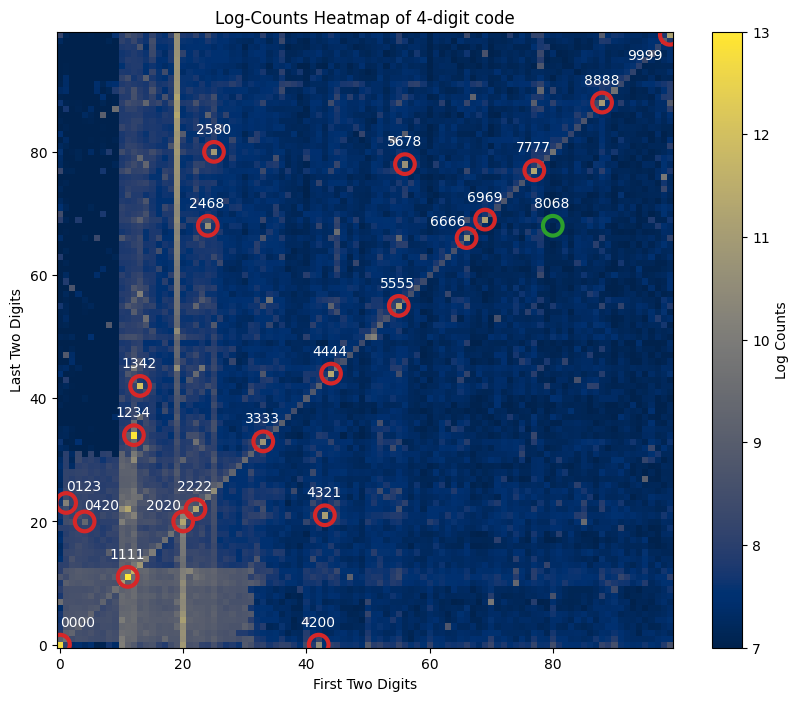

# Introduction

It's 2025, who still uses 4-digit codes? Well, checkout terminals do, although these codes
are nowhere close to the only mechanism to protect consumers, they are a code that many 
consumers set with a level of security knowing that their choice is what stops a perpatrator
from accessing their account. Going from this, I wanted to pursue 4-digit pins as a surrogate 
for how people try to set secure passwords. Afterall, there is a similar balance of needing 
something memorable that you can quickly input but is not *too obvious*. 

This balance is obviously way less defined in the 4-digit pin case compared to alphanumeric 
variable-length passwords with special characters and capitalization. For one, the 
constant-sized constraint of this significantly reduces the ability to tune the speed of
inputing (this is ignoring the fact that you really shouldn't be trying to optimize how fast
it is to input a 4 digit password). The other end of this is 4-digit pins are much less secure
than typical alphanumeric passwords where most sites require more than 8 digits. An optimistic
calculation of an alphanumeric password with 8-12 digits requires a malicious entity to try 
$72^{8}-72^{12}$ possible combinations. When compared to a 4-digit pin with $10^4$, this is a 
puny amount.

Disclaimer: Unlike passwords we use everywhere, 4 digit pins aren't meant to have high entropy
and instead operate by having a very low number of allowed trials ($\approx 3$) before the card
is locked. This is to strike a balance between easy to remember when purchasing at the kiosk
but just enough to add a layer of security. This will have implications to the strategy one
should use for a code: see [What does this mean for my pincode?](#what-does-this-mean-for-my-pincode).

My hope is that this:
1. will be a fun excersize on the axis of the human psychology on password choosing - maybe with some transferable knowledge to more complicated passwords. 
2. serve as a reminder of why pin-codes aren't that great of a baseline for generic authentication and that using good (high-entropy) password generation techniques are important. (See [Apple Automatic Strong Passwords](https://support.apple.com/guide/security/automatic-strong-passwords-secc84c811c4/web) or [1Password's blog post on generating strong passwords](https://blog.1password.com/how-to-generate-random-password/)).

- TODO: FIDO U2F?

# Data retrival

I will be using the [haveibeenpwned.com](https://haveibeenpwned.com/) API to retrieve information about leaked passwords. 
This is a great website that allows you to check if a password you use has been leaked using a smart mechanism to keep your
password secure. It relies on the basis of hash functions that takes an input string to a long hexadecimal string 
$h(p) \xrightarrow{} s$ where $p$ is our password and $s$ is a hash of that password. These hash functions are typically hard
to reverse with classical computers. The querying procedure is as follows

1. Take the hash of of your password $s = h(p)$
2. Take the first 5 digits of $s$, $s_{1:5}$ and send this to the API
3. The API will return the frequencies (counts) of all passwords whose hash start with $s_{1:5}$.
   - One of these hashes will be the hash $s$, all the others will be other passwords - typically around 500-1000 other passwords.
   - If a perpatrator found a way to listen to these requests, they won't be able to identify which hash is yours, keeping the password secure.
4. You can compare the ending of your hash and the returned hashes to figure out which entry (if any!) corresponds to your password.
   - If you see an entry, the counts correspond to the number of times its been leaked from the vast amount of leak data [haveibeenpwned.com](https://haveibeenpwned.com/) has been collecting.
   - Not all of those instances will always correspond to your accounts if someone else happened to use the same password. But you can make sure this doesn't happen by choosing a more secure password.

I do the above procedure for all 4-digit pins spanning `0000-9999`.

# Data Time!

Now that we have this data, let's analyze it. One visualization I particularly enjoyed and decided to reproduce using up-to-date data 
is from [the late Nick Berry's blog Data Genetics](http://www.datagenetics.com/blog/september32012/index.html). 

## Interactive Plot

Before getting into the analysis, here is an interactive plot you can play around with. The x-axis is the first two numbers of a pin
and the y-axis is the last two. The colormap is the log counts of uses, the brighter/yellower it is, the more common of a passcode
it is (that's worse). Hover on different pins to see what their counts are and feel free to make some hypotheses before we dive deeper!

## The O.G. Figure

This figure is replicating the 2012 igure from [Nick Berry's blog](http://www.datagenetics.com/blog/september32012/index.html) with updated information.
Below is a static version of the image for no-js browsers.

<figure>
   
  <figcaption>Figure plotting the log-counts of various 4-digit pins where the x-axis and y-axis are the first and last two digits of the pincode respectively. It's easy to see correlations in the data,
  such as the diagonal representing repated doublets (code of the form $c_1c_2c_1c_2$) or the vertical feature at 19/20 corresponding to passwords with the basis of years under them (for example, codes based on birthdays).
  </figcaption>
</figure>

We can see several notable features such as a strong vertical features, a strong diagonal, random-seeming spikes of color with some 
diagonal structures, a large dark band on the left and finally a weird `y=x` symmetric bright region in the bottom left corner. We'll
analyze all of these (and more!) in the next sections.

# In Depth-Analysis

## What years are code-years

Let's zoom in on the vertical feature from the above plot

<figure>
   
  <figcaption>Figure plotting the frequency of codes that start (left subplot) and end (right subplot) with 19. We can see that the frequency of passwords that stay with 19 are much more common than
  other random passwords (median in red) and than passwords with 19 in the last two digits. This means that the 19 at the beginning has
  some entropy to it.
  </figcaption>
</figure>

The next thing I wanted to look at was what was the distribution of the years people tend to write down: 

<figure>
   
  <figcaption>
  </figcaption>
</figure>

It looks like the distribution resembles a gaussian centered around the year 1988 with a standard deviation of 19 years 🤷. This is smack in the middle
of the timeframe millenials are considered to be born with a std slightly larger than a generation. This makes some sense given the population that uses
system's that rely on 4-digit pins and the recent trends toward safer codes. These years don't necessarily equate to birthdays only, it could be children's/parent's
birthdays, weddings or any other dates of note (if not non-date related reasons), but the assumption of birthdays seems to be plausible given this gaussian-like
distribution and the makeup of the population.

## Date Codes

<figure>
   
  <figcaption>

- (a) i. zoom into the lower-left corner of the figure in [The O.G. Figure](#the-og-figure), highlighting two regions that correspond to dates.
- (a) ii. the green vertical segment pre-rotation
- (b) Number of days per month for a calendar year (including leap years)
- (c) i. the red region from (a) i. corresponding to codes that resemble a date of the format DD/MM.
- (c) ii. the green region from (a) ii. rotated to resemble (c) i. for dates of the format MM/DD.

  </figcaption>
</figure>

There is a $y=x$ symmetric structure in the bottom left of the main figure that resembles codes built from joining months and days together.
We can verify this by seeing how the structure in (c) i and ii matches that of (b), where the months that have less than 31 days have a divot in them.
The median of the `DD/MM` code panel (red dashed pane) is greater than that of the `MM/DD` panel (green solid), suggesting it is more common
as a pin code.

For the curious, here is a heatmap of aggregated birthdays from the social security administration:

<figure>
   
  <figcaption>

A representative distribution of U.S. Birthdays over the span of 15 years. Dips can be seen
on major observed U.S. holidays and February 29th (a leap day). A birthday on February 29th
is 4 times less likely than any other day.

  </figcaption>
</figure>

The frequency of the code `0229` is 41% as much as that of `0228`, whereas the birthday 02/29 frequency is
25% as much as of 02/28.

About 17.8% of codes can be considered date codes (if pin codes were equally frequency, this would instead be 6%).

## The diagonal feature

There is a prominent diagonal feature in the main heatmap that represents code with 2 repeating digits.
This prominent diagonal features an additional spike every $\approx 11$ tiles, as is evident in the plot
below, which plots the frequency vs. the repeated sequence of 2 digits.

<figure>
   
  <figcaption>
  </figcaption>
</figure>

We can notice that there are two additional peaks that are even more frequent than all repeated digit
codes (for example, `3333`). These peaks at `2020` and `6969` are probably significant due to their 
correspondance with meme-y dates.

7% of all codes lie on the diagonal feature, as opposed to an expected 1% of the code space being
taken up by diagonal codes.

## Common Digits

Below is an analysis of the most common digits counting repetitions in blue and without counting
repetitions in orange. As in, `0000` is counts `0` four times in blue and once in orange.

<figure>
   
  <figcaption>
  </figcaption>
</figure>

`1` and `2` are the most common digits followed by `0` if you allow for repetitions and `3` if you don't.
This is probably because many of the `0` codes get halved in frequency if the code is based on a date.

## Least used space of pins

There is an interesting gap when the first digit is `0` and the last two digits are `>31`.
This probably has to do with people being less likely to write a 4 digit number that starts with `0`. 
The reason some numbers are populated densely at the bottom is the prevalance of the code `0000` and the
overlap with the date grid - hence the `>31`.

4.6% of codes used occupy this region of space, even though the size of this region is 6.8% of the total 
possible space of codes. This is a pretty good indication that this region is very underutilized and you 
should consider codes in this region next time you are crafting a pincode.

## What about rotational codes

I looked into this way less than I wanted, but for every project, there comes a time where you need to decide 
to stop going down rabbit holes and leaving it for your (or someone elses! maybe you?!) future self.

Here I decided to take some random convinient codes that have a nice clockwise (CW) or counter-clockwise (CCW)
rotation to them and decided to see which orientation of a code is more common. I think this points towards CW
codes being more common, but further investigation is needed.

<table border="1" class="dataframe">
  <thead>
    <tr>
      <th>Code Generator</th>
      <th>Preferred Orientation</th>
      <th>CW Permutation Counts</th>
      <th>CCW Permutation Counts</th>
    </tr>
  </thead>
  <tbody>
    <tr>
      <td>4268</td>
      <td>CCW</td>
      <td>11635</td>
      <td>17383</td>
    </tr>
    <tr>
      <td>1397</td>
      <td>CW</td>
      <td>11161</td>
      <td>9439</td>
    </tr>
    <tr>
      <td>1254</td>
      <td>CW</td>
      <td>17781</td>
      <td>13652</td>
    </tr>
    <tr>
      <td>4587</td>
      <td>CW</td>
      <td>8017</td>
      <td>7959</td>
    </tr>
    <tr>
      <td>5698</td>
      <td>CW</td>
      <td>7624</td>
      <td>7036</td>
    </tr>
    <tr>
      <td>5907</td>
      <td>CW</td>
      <td>5128</td>
      <td>4735</td>
    </tr>
    <tr>
      <td>1367</td>
      <td>CW</td>
      <td>6998</td>
      <td>6168</td>
    </tr>
    <tr>
      <td>1394</td>
      <td>CW</td>
      <td>6988</td>
      <td>6326</td>
    </tr>
    <tr>
      <td>1287</td>
      <td>CW</td>
      <td>8420</td>
      <td>7058</td>
    </tr>
    <tr>
      <td>1354</td>
      <td>CCW</td>
      <td>8974</td>
      <td>20038</td>
    </tr>
    <tr>
      <td>1365</td>
      <td>CW</td>
      <td>8799</td>
      <td>7285</td>
    </tr>
  </tbody>
</table>

It would be fun to model this more intently by including a model of how "hard" hitting certain 
keystrokes (and the order) of them is. For example, by adding some form of weighted cartesian-esque 
distance between keys and the resting position of a thumb after the previous key.

## Common (and 1 not very common) Codes

<figure>
   
  <figcaption>
  </figcaption>
</figure>

Looking at the heatmap, I circled a subset of the highest frequency codes in red. A malicious entity would cycle through as many of these
high frequency codes before an account gets locked. Ensuring your pin is not one of them decreases the probability they can successfully 
log in/complete a transaction. The most common of these pins is `1234`, followed by `1111`. Some of them are meme-y `0420` while others 
are just counting.

When Nick originally published his post, he feared that the least utilized pin at the time `8068` would become one of the highest
frequency pins after everyone starts adopting this pin (see (nash equilibrium)[https://en.wikipedia.org/wiki/Nash_equilibrium] for more details). 
I'm happy to report that after 13 years later, 8068 is no where near the most used pin (within lowest 6% of pin codes). 
The least used pin in this dataset this time around is `0849` - if one extrapolates the public's indifference to optimal solutions, using this
as your next code will probably be a safe bet.

# What does this mean for my pincode?

While the pin code wasn't designed to be infinitely secure for credit cards, you definitely want to use a non-frequent (not circled in red) 
code when using a 4 digit code. Avoiding birthdays and information linked to your personhood is often a good idea, as a malicious agent can
find easy ways to access information such as date of birth and addresses through social engineering, stalking or data leaks.
If you want use this data as a prior when generating a pincode, you technically are more secure choosing a password where the first digit 
starts with `0` and the third digit starts with a number larger than `3`. If this blogpost ever blows up and everyone uses this recipe for a code, 
Nick's warning about the `8068`-code might actually apply in this case -- this would decrease your code parameter space by a factor of $\approx 93 %$
rendering your code crackable.

TODO: correlated info from leaks, dint reuse apsswrods

**As for any other place you can opt to choose a more secure code, do that**. For instance, you should be using your iPhone's 6-digit pin and 
refrain from using the 4-digit pin option. This is incredibly important as this code can aid someone in gaining access to your iCloud account
and/or open credit cards with this information, as reported on in [this WSJ article]([https://www.wsj.com/tech/personal-tech/apple-iphone-security-theft-passcode-data-privacya-basic-iphone-feature-helps-criminals-steal-your-digital-life-cbf14b1a]) for example. For
alphanumeric inputs for passwords, don't use 4 digit pins, use a strong alphanumeric password. For resources on good password practices, see
[Apple Automatic Strong Passwords](https://support.apple.com/guide/security/automatic-strong-passwords-secc84c811c4/web) or
[1Password's blog post on generating strong passwords](https://blog.1password.com/how-to-generate-random-password/).

# Acknowledgements

- ***Nick Berry*** for the original idea and innovative work early on.
- ***Sophia Diggs-Galligan*** for fun and insightful conversations on the data analysis portion.
- The ***HaveIBeenPwned*** team for making all this useful data available to everyone via their free API.