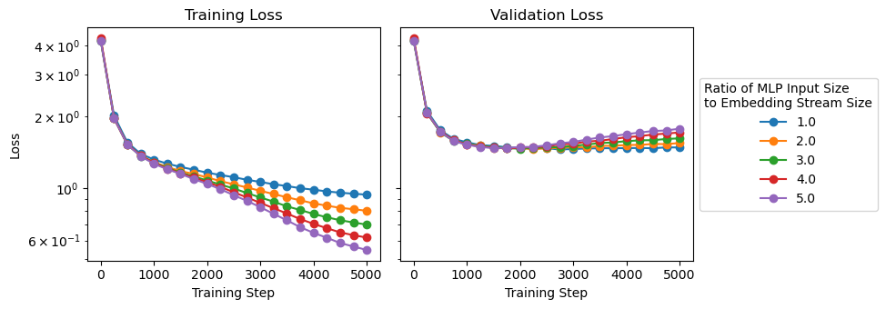
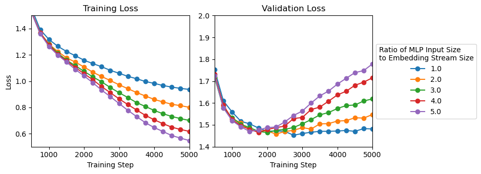

# Introduction

The Multi-Layer Perceptron (MLP) layer within a transformer typically has an input embedding size that is $4$ times that
of the embedding stream. This is largely (as far as I can tell) a random prefactor that was used back in the early days of
GPTs when we wanted a way for the MLP layer to extract rich features and capture complex relationships between input tokens.
This is a common design pattern in many transformer models, including GPT, where the MLP layer is often set up to 
significantly increase the representation size before contracting it back to the original dimension.

# Effect of MLP width on an Overfitted Tiny Language Model

<!-- 

<figure>
   
  <figcaption>
    Training a small language model with 5 different input embedding sizes for the MLP layer. As you increase the width, the model trains and overfits faster.
  </figcaption>
</figure>

 -->

<figure>
   
   
  <figcaption>
    Training a small language model with 5 different input embedding sizes for the MLP layer. As you increase the width, the model trains and overfits faster.
  </figcaption>
</figure>

We see that as the MLP's width decreases wrt the embedding stream size, the model learns slower, but also overfits even slower. Details of the model and its training details are below. Overfitting is a function of this dataset being tiny! I plan to repeat this experiment on the output of OpenWebText to reproduce the GPT-2 model as well as varints of that model with different MLP widths.

Another interesting follow up would be repeating this with specialized single learning tasks with limited that work well in limited embedding size applications (allowing much more sweeps). For example, a training set where the tokens teach the model to add integers or modulo multiplication. It would be interesting to study the scaling of the number of learning tasks with the width of the MLP layer.

Until then, we have a demonstration of how the intuition behind the MLP width is correct in practice. Increasing the size of the MLP allows it to discover more aggregate features of the data where in the limit of small data, we see fast overfitting. The other cool thing to notice is that (at least for this tiny model), the width of 4 is by no way an optimal width that was fine-tuned, but is probably an arbitrary choice. In terms of compute, reducing the size of that layer would allow us to churn through more data and produce fast training results (in something like GPT-4, reducing the width of the MLP by $25%$ would lead to a reduction in parameters of somethuing like 225 Billion parameters!). The optimal point for larger datasets may by somewhere between 3 and 3.5, and is probably a function of the number of learning tasks.

## Model and Training Details

<table border="1" width="100%">
  <thead>
    <tr>
      <th>Category</th>
      <th>Details</th>
    </tr>
  </thead>
  <tbody>
    <tr>
      <td>I/O</td>
      <td>
        Evaluation Interval: Every 250 iterations 
        Log Interval: Every 10 iterations 
        Evaluation Iterations: 200 iterations 
        Initialized from random weights
      </td>
    </tr>
    <tr>
      <td>Data</td>
      <td>
        Training: 1,003,854 tokens 
        Validation: 111,540 tokens 
        Dataset: <code>shakespeare_char</code> 
        Gradient Accumulation Steps: 1 
        Batch Size: 64 
        Block Size: 256
      </td>
    </tr>
    <tr>
      <td>Model</td>
      <td>
        Number of Layers: 6 
        Number of Attention Heads: 6 
        Embedding Size: 384 
        Dropout Rate: 0.2 
        No bias inside LayerNorm and Linear layers 
        MLP Ratio: varied through experiment
      </td>
    </tr>
    <tr>
      <td>Optimizer (AdamW)</td>
      <td>
        Learning Rate: <code>1e-3</code> 
        Max Iterations: 5000 
        Weight Decay: 0.1 
        Beta1: 0.9 
        Beta2: 0.99 
        Gradient Clipping: 1.0 (disabled if 0.0)
      </td>
    </tr>
    <tr>
      <td>Learning Rate Decay</td>
      <td>
        Decay Learning Rate: True 
        Warmup Iterations: 100 
        Learning Rate Decay Iterations: 5000 
        Minimum Learning Rate: <code>1e-4</code>
      </td>
    </tr>
    <tr>
      <td>System</td>
      <td>
        Device: <code>mps</code> on Mac w/ M1 Max
      </td>
    </tr>
  </tbody>
</table>

## Acknolwedgements

Thanks to all the work from Kaparthy and contributors on [nanoGPT](https://github.com/karpathy/nanoGPT) that was essential for this small investigation.