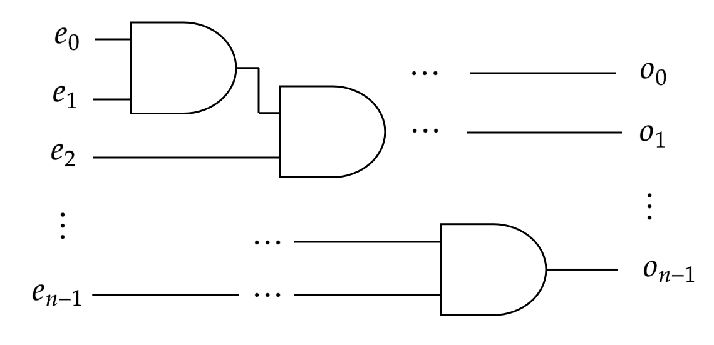
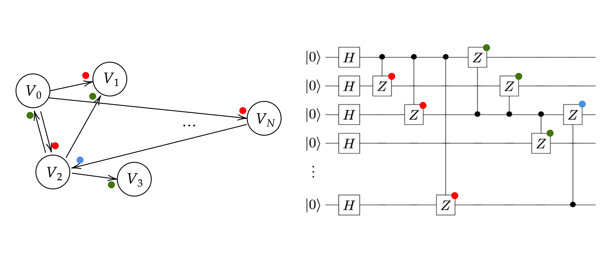
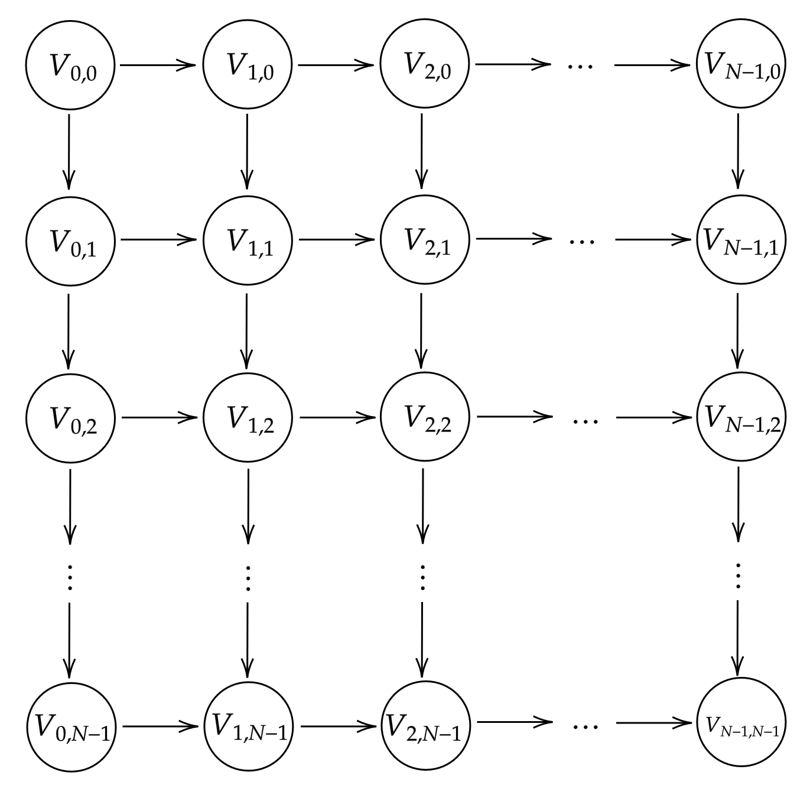
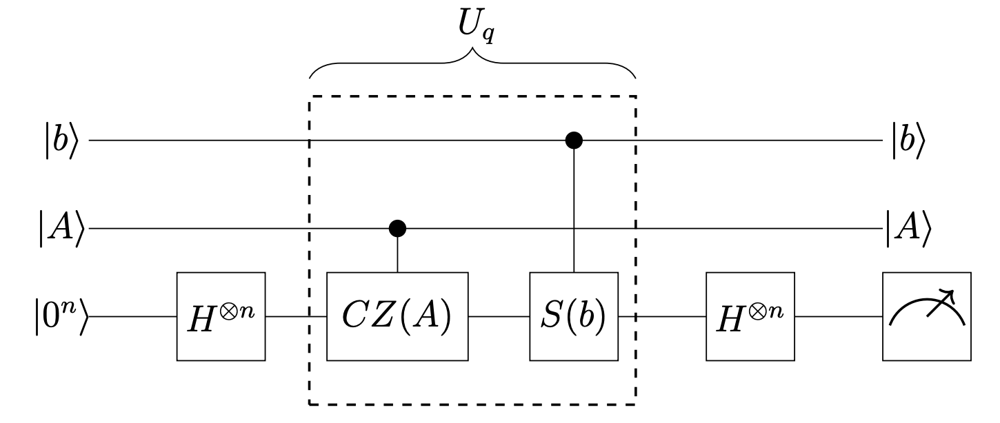
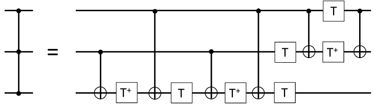

$\newcommand{\NC}[1]{\mathsf{NC^#1}}$
$\newcommand{\BQP}{\mathsf{BQP}}$
$\newcommand{\BPP}{\mathsf{BPP}}$

# Introduction

This is originally a write-up I did back in 2020, I've referenced it a few times
since and found the need to go back through my old overleaf account one-too-many-times.
Now... this blog post exists.

The paper by S. Bravyi, D. Gosset and R. König [\[1\]](#references)
proves a separation
between classical circuits of constant depth 
($\NC{0}$) and quantum circuits of constant depth (Shallow Quantum Circuits, SQCs). 

## Constant-Depth Classical Circuit Model

A classical circuit is a directed acyclic graph where each
node represents a classical gate and the edges represent
inputs and outputs of the gate (edges directed into a node
are inputs and vice versa). Each gate is a many-to-one function $\{0,1 \}^k \xrightarrow{} \{0,1\}$, where $k$ is the in-degree of the gate (or fan-in). Each gate can output one value, but the value can be reused many times in the computation by changing the out-degree of the gate (or fan-out).

Probabilism is added to the model by defining the input $x$
as $x=x' \cdot r$ where $r$ is a string sampled from some 
random distribution and $x'$ is the deterministic input.

In this model, we restrict two parameters, depth $D$ and fan-in $K$.
The depth of a classical circuit is the longest possible path from
an input bit to an output bit. Limiting the depth limits the number
of functions $f: \{0,1 \}^k \xrightarrow{} \{0,1\}$ that we can apply on each bit. The other parameter, fan-in, controls the in-degree of each node. In other words, the fan-in bounds the number
of inputs $k$ each gate function $f$ takes in.

<figure>
   
  <figcaption>Classical Circuit example with input $e$ and output $o$.
  </figcaption>
</figure>

## Variable Correlations and Lightcones

We can study interactions between input and output variables
in classical circuits
using correlations and lightcones. Given an input string
$e$ and output string $o$, we say that the input bit $e_i$ is
correlated to the output bit $o_j$ iff there is an input $e=x$ st.
$(e_i, o_j) = (x_i, y_j)$ and $(e_i, o_j) = (\bar x_i, \bar y_j)$. 
In other words, $e_i$ is correlated to $o_j$ if there is any input 
string where flipping its $i$-th bit flips the $j$-th bit of $o$.

This is particularly helpful as we can imagine what interactions
each input bit has over output bits. If the value of an input bit
never affects the value of an output bit, then we can imagine
that there is no interaction happening between these two bits.

We can extend this and talk about Lightcones of classical circuits.
The lightcone $L_\mathcal{C}(e_i)$ of a classical circuit 
$\mathcal{C}$ with an input bit $e_i$ is the set of all
output variables $o_j$ that are correlated to $e_i$. We can define
the lightcones of output bits similarly where the lightcone 
$L_\mathcal{C}(o_j)$ on the output bit $o_j$ is the set of input bits
$e_i$ that are correlated to $o_j$.

By limiting the depth $D$ and fan-in $K$ on a circuit with $N$ 
input bits, we can see we restrict the
lightcones of our input and output bits. Lets take the example
where $(D, K) = (1, N)$, then we can apply any desired function
on the input bits. If we were applying a modulo 2 sum operation
on all the input bits, we can use one function to act
on all $N$ bits and add them together. On the other hand,
if we limit the fan-in to $2$, constructing the same addition
operation would require a $\log_2 N$ depth circuit. On other words,
limiting $D$ and $K$ limits the lightcones of the output bits and the computational ability of our model.

This restricts the size of the lightcone of any output bit $z_j$ to 

$$|L_\mathcal{C}(z_j)| \leq K^d$$

In the original paper, we care about constant depth, constant 
fan-in circuits ($\NC{0}$) which means all our output bit lightcones have a constant size.

## Shallow Quantum Circuit Model

We restrict our attention to shallow quantum circuits. Shallow
quantum circuits are quantum circuits that can be decomposed into
one and two qubit gates in the Clifford$+T$ group and that have
constant depth.

## Graph States

Graphs $G=(V, E)$ are encoded as a quantum graph state $\ket{\Phi_G}$.
A graph state can be constructed as follows (with an accompanying figure below): 

$$\ket{\Phi_G} = \left ( \prod_{1\leq i <  j \leq |V|} CZ_{ij}^{A_{ij}} \right ) H^{\otimes |V|} \ket{0^{|V|}}$$ 

This graph state encodes an edge between nodes $i$ 
and $j$ by applying a controlled-Z gate between qubits
$i, j$, otherwise it applies an identity. Note that this
construction need not be done in constant time, take the example
where a node $i$ is connect to all other nodes, then this construction
requires $N$ controlled-Z gates applied on $i$. This will be discussed more in depth in section [2D Hidden Linear Function Problem](#2d-hidden-linear-function-problem).

The paper shows that the graph state $\ket{\Phi_G}$ is a 
stabilizer state that generates the stabilizer group defined by
$g_v = X_v \left ( \prod_{w: \{ w, v\} \in E} Z_w  \right )$, $\;g_v\ket{\Phi_G} = \ket{\Phi_G}$ for $v\in V$. This is important
since they use it in the paper to generate an inequality similar to
that of a GHZ state. This shows that the circuit exhibits non-locality
and a lightcone analysis of propagation of variables in computation
doesn't work as in the classical case.

<figure>
   
  <figcaption>The Quantum Circuit on the right constructs a Graph State for the graph on the left by applying CZ gates wherever there are edges.
  </figcaption>
</figure>

## Hidden Linear Function Problem

We construct a non-oracular problem that poses a similar statement
to the Bernstein-Vazirani (BZ) problem. In the BZ problem have a
function $l(x) = z^Tx\mod 2$ encoding a hidden secret string $z \in \{ 0,1\}^n$. 
Classically we can determine $z$ with $n$ calls. A quantum circuit
solution with $1$ call can be constructed by defining an oracle
$U\ket{x}=(-1)^{z\cdot x}\ket{x}$. The Hidden Linear Function (HLF) problem similarly encodes a secret string $z$ in a quadratic form 
$q: \mathbb{F}_2^n \xrightarrow{} \mathbb{Z}_4$ defined as

$$q(x) = 2 \sum_{1\leq \alpha < \beta \leq n} A_{\alpha, \beta} x_\alpha x_\beta + \sum_{\alpha=1}^N b_\alpha x_\alpha$$

with binary variables $x_1, \dots x_n \in \{0, 1\}$.

The HLF problem is parameterized by a $n\times n$ matrix $A \in \{0, 1\}^{n^2}$ and
length $n$ vector $b \in \{ 0, 1\}^n$. Addition ($+$) is defined to 
be modulo four addition, meanwhile modulo two addition will be
denoted using the $\oplus$ operation.

The quadratic form $q$ hides a string $z$ when restricting a set
to linear subspace $\mathcal{L}_q$ defined by $q$. 

$$
\mathcal{L}_q = \{
x \in \mathbb F_2^n: 
q(x\oplus y) = q(x) + q(y)\; \forall y \in \mathbb{F}_2^n
\}
$$

$\mathcal{L}_q$ is a linear subspace of $\mathbb{F}_2^n$ since for
any pair $x, x' \in \mathcal L_q$, then $x\oplus x' \in \mathcal L_q$.
We also know that $q(0) = 0$ from $q$'s definition and $q(x\oplus x) = 2q(x)$. Therefore we can see that $2q(x) = 0$ for any $x\in \mathcal L_q$, i.e. $q(x) = \{ 0, 2\}$. We can define $l(x) = q(x)/2 \in \{ 0, 1\}$ which is linear modulo two. This means that $l(x)$ can be defined
as $l(x) = z^Tx$ for a hidden string $z$ and as a result 
$q(x) = 2z^Tx$.

Note that $z$ is not a unique hidden string since for any string $y\in \mathcal L_q^\perp$, $z\oplus y$ is also a valid hidden string. This can be seen by showing that $(z\oplus y) \cdot x = z\cdot x + 0$.

## 2D Hidden Linear Function Problem

The paper looks at a specific type of HLF problem, the 2D HLF, 
that can be
solved using a SQC. We can imagine that the solution presented in
the paper won't work on a SQC since encoding any arbitrary graph into
a graph state as shown in the [Graph States](#graph-states) section will
not necessarily be of constant depth. A complete graph for example
will require a depth that scales with the size of the graph.

<figure>
   
  <figcaption>An $N\times N$ example graph of the setup in a 2D Hidden Linear Problem.</figcaption>
</figure>

The 2D HLF is defined st. you have a 2D $N\times N$ graph 
($G=(V, E)$) in a grid shape 
where each node has an edge pointing towards the next node on both 
axes. I.e. the node $V_{i,j}$ has an edge directed to $V_{i+1,j}$ 
and $V_{i,j+1}$.

Given this structure, we define the 2D HLF problem as choosing a
subgraph of $G$ using an $N^2 \times N^2$ matrix $A$. Most entries
of $A$ are $0$ since there is no edges between most nodes. 
For ease of notation, we will define $A_{i,j,k,l} \equiv A_{(i+N\cdot j), (k+N\cdot l)}$
Every
entry of $A$, $A_{u,v,t,w}$, represents an edge directed from $V_{u, v}$ and $V_{t, w}$. This means that if $(t, w) \neq (u+1, v+1)$ then $A_{u,v,t,w} = 0$. In the cases where there is an edge, the choice of
whether an edge exists or not is a parameter $x_i \in \{0, 1\}$. This
means we end up with $|E| = 2N(N-1)$ variables $x_i$.

# Results

<figure>
   
  <figcaption>
  Quantum Circuit with constant-depth that solves the 2D Hidden Linear Function Problem. It solves any Hidden Linear Function Problem without the promise of being constant-depth.
  </figcaption>
</figure>

## SQC: Proof of Solution

The circuit shown in the figure above is a
constant-depth quantum circuit that solves the 2D HLF problem.
We can show that it is a solution by applying each operation in
seqeunce. First $H^{\otimes N^2}$ takes $\ket{0^n}$ to a superposition of all possible strings. Looking from the partial
fourier transforms point of view,
$U_q\ket{x} = i^{q(x)} \ket{x}=(-1)^{z^Tx}\ket{x}$ takes our state to 

$$
\begin{align}
    \Gamma (y) &= \sum_{x\in \mathcal L_q} i^{q(x)} (-1)^{y^Tx}\newline
    &= \sum_{x\in \mathcal L_q} (-1)^{z^Tx} (-1)^{y^Tx} \ket{x}\newline
    &= \sum_{x\in \mathcal L_q} (-1)^{(z\oplus y)^Tx} \ket{x}
\end{align}
$$

Note that $\Gamma(y)$ is an identifying function where if $y$
is the secret string $z$, then the sum returns $|\mathcal L_q|$
otherwise it is $0$.

$$
\begin{align}
\Gamma(y) = \begin{cases}
        |\mathcal L_q| \; \text{if} \; z\oplus y \in \mathcal L_q^\perp\\
        0 \; \text{otherwise}
    \end{cases}
\end{align}
$$

and $z\oplus y \in \mathcal L_q^\perp$ iff $y$ is a valid hidden
string. Recall that the secret string is not unique. If we convert
this to a probability of measurement, the probability of seeing an
output $y$ is
$p(y) = |2^{-n}\Gamma(y)|^2$. Meaning that $p(y) \geq 0$ iff $y$ is a solution, otherwise $p(y) = 0$.

## SQC: Proof of Shallowness

We proved that the circuit in the figure above is a 
solution to the 2D HLF problem. We now will show that this
circuit can be constructed in constant depth. The protocol
has 3 different operations: (1) $H^{\otimes N^2}$, (2) $CS(b)$
and (3) $CCZ(A)$.

We can see that the first operation is a single qubit gate
acting once on every qubit, therefore it has constant depth.
The second operation can be separated into 2 qubit $CS$ gates
acting on disjoint qubits, where $i$-th gates the control is 
$\ket{b_i}$ and the destination is $\ket{q_i}$.
The third operation is where the constraint that distinguishes
the 2D HLF problem from the general HLF problem. We note that
the $CCZ(A)$ gate application can be separated out into 4
operators that act on disjoint qubits for every alternating 
edge sequence. This means that we can implement $CCZ(A)$
by applying a maximum of $4$ $CCZ(A_{i,j,k,l})$ gates.

 

<figure>
   
  <figcaption>
  Implementation of the CCZ gate on three qubits using gates only from the Clifford+T group. This diagram is from the reference <a href="#references">[2]</a>.
  </figcaption>
</figure>

 

We now need to show that the $CCZ$ and $CS$ gate are constructable
in constant-depth using only the Clifford$+T$ group. For $CS$, this
can be done using the $T$ gate. Note the identity on a control and target qubit 
$\ket{c}, \ket{t}$ respectively: 
$CU\ket{ct} = \sqrt{U} CX \sqrt{U^\dagger} CX\ket{ct}$ and since 
$U=S$ and $\sqrt{U} = T$ then this is implementable using the Clifford$+T$ group. 
We can also note that the circuit in figure above
is an implementation of the $CCZ$ gate that only uses gates from
the Clifford$+T$ group.

## 2D Hidden Linear Function $\not \in \mathsf{NC^0}$

The paper also shows that since the lightcone of circuit $\mathcal C$
has a bound on its size based on the depth $d$ and fan-in $K$ $|\mathcal L_C| \leq K^d$. The paper uses that to prove

> **Theorem**
> 
> Any classical probabilistic circuit with bounded fan-in gates that solves the
> 2D Hidden Linear Function problem with success probability greater than $7/8$ must have
> depth $\Omega(\log N)$. 

They specifically show that the depth of $\mathcal C$ is at least
$\dfrac{1}{8}\dfrac{\log N}{\log K}$ to solve the problem with a
probability greater than $7/8$. This means that the problem is
not solvable in constant depth and as a result not in $\NC{0}$.

# Discussion

## SQC Separation from $\mathsf{NC^0}$

These results show a separation between Shallow Quantum Circuits
and Classical Circuits with constant depth even when given
probabilism. This paper presented a more ambitious goal
than showing a separation between $\BQP$ and $\BPP$ by tackling
constant depth circuits or even SQCs and $\BPP$ as it would
imply a separation between $\BQP$ and $\BPP$.

This separation is especially cool because it is non-oracular.
This means that unlike Bernstein-Vazirani, we know this translates
directly into computational advantage, where BV oracles might
not be constructable efficiently.

The solution also applies gates locally on a 2D grid. Even with the extra restriction on
the applications of gates locally it still showcases quantum advantage and is more realistic in terms of
immediate quantum advantage since local applications
are more realistic.

<!-- % ## Non-Oracular

% ## Local Gates -->

## Non-Locality

The quantum advantage here is due to employing quantum
non-locality. We can show that since a classical
circuit and quantum circuit would both obey the lightcone method, especially since we restrict the application of quantum gates to two qubits. We could
see that this would be analagous to a classical 
circuit with a max fan-in of 2. The only difference between
SQCs and classical circuits with constant depth is the 
non-locality allowed, hence the quantum advantage is
directly due to the non-locality exhibited.

The 2D HLF problem constructs non-local states in constant time, meanwhile the GHZ construction takes more than
constant time. This result shows that we can
construct non-locality in constant time and using
local operations!

# References

1. Sergey Bravyi, David Gosset, and Robert Konig. Quantum advantage with shallow
circuits. Science, 362(6412):308–311, October 2018.
2. Edwin Barnes, Christian Arenz, Alexander Pitchford, and Sophia Economou. Fast
microwave-driven three-qubit gates for cavity-coupled superconducting qubits. Physical Review B, 2016.