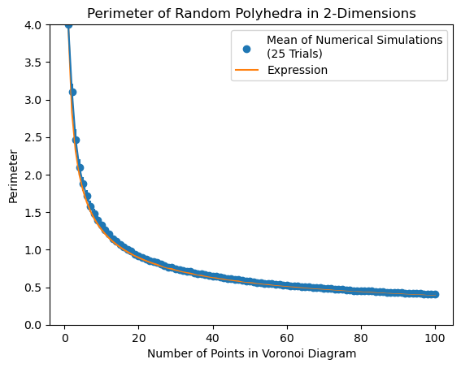
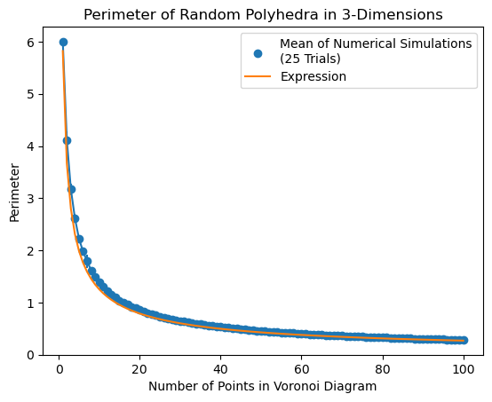
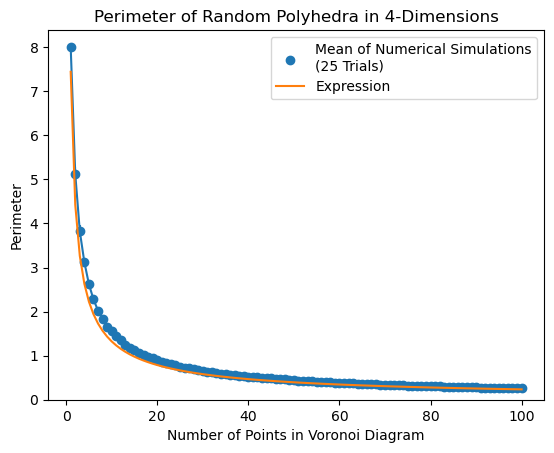

# Introduction

I was watching [PurpleMind's YouTube video](https://www.youtube.com/watch?v=Y6bWUfmJ0-4) on the perimeter of cells in a Voronoi
diagram where they discussed aggregated results from a large set of submissions on the solution for the perimeter of a Voronoi
diagram. You should definitely go watch the video, it's well produced and thought provoking (I mean... I'm writing a blog at 
11pm after having watched the video, so it must have been). 

> **EDIT**
> 
> It's actually a few days later now due to scope creep :) At least the derivation is for arbitrary dimensions and convex shapes of the aggregate Voronoi diagram, woo!

<br/>

As a summary of the video, a Voronoi diagram is a type of 2D plot
that describes polygons based on the closeness of points over some subspace $S \subset \mathbb{R}^D$ with dimension $D$.
For the sake of this post, we'll be talking about $S$ spanning 
$[0, 1]$ on all of its axes, We will be defining these voronoi cells on a space $S=\square_D$:

$$
\square_D = [0, 1]^D = \{ (x_1, x_2, \ldots, x_D) \in \mathbb{R}^D \mid 0 \leq x_i \leq 1 \text{ for all } i = 1, 2, \ldots, D \}
$$

The notation $\square_2$ ($D=2$) specifies the case shown in PurpleMind's video, but we will derive the equation for arbitrary dimensions in this video. 

> Notice that the volume of the subsace of all voronoi cells is a constant regardless of 
> number of cells since the volume of anything that fills $\square_D$ is $1^D$. 
> 
> However, the surface area is dependent on the dimension and number of cells - 
> in the one cell case, the surface area of the one cell is the area of 
> a $D$-dimensional cube: 
> $2D\cdot 1^{D-1}$.
>
> > This is due to the fact we have $2D$ sides, each with area ($D-1$ volume) $1^{D-1}$ 
> > e.g.
> > - A square ($D=2$) has $2D=4$ lines, each line with length $1^1=1$
> > - A cube ($D=3$) has $2D=6$ squares, each square with area $1^2=1$ 
> > - A 4D hypercube ($D=4$) has $2D=8$ cubes, each cube with area $1^4=1$ 

One common place to be exposed to generate Voronoi cells is from a classification using k-means clustering. The
video is concerned with the problem of calculating the average perimeter of Voronoi cells for a random choice of $p$
points sampled uniformly at random over $S$. The video shows there is very good reason to believe the perimeter 
follows the expression

$$E[P_2] = \dfrac{4}{\sqrt{p}}$$

primarily through numerical simulations and intuition about toy versions of the problem (uniform grids, etc.).
Notice how when there is one point in the square, the expected perimeter is $4$, since the entire subspace is a
Voronoi cell. Whereas when $p\xrightarrow{} \infty$, we get that $E[P_2]\xrightarrow{} 0$. 

In this post I will aim to show a derivation of this using probability theory - an element of the video that remains
unsolved. The video focuses on $D=2$, but I will keep it general here, since there are many other (high-dimension) applications
where I can see this derivation being useful, from physics all the way to ML.

## Some more motivation

You should feel free to skip this section, I like to think about random applications of math in

- classification algorithms
- crystals and defects: there is literature on this
- 

A slight tangent about poisson point distributions and uniform distributions...

# Derivation

There is a [section below](#code-to-follow-along-the-proof) to follow along the proof and generate the expressions in Python's sympy.

Given a volume $V\subset \square_N$ and the number $n$ of voronoi cells in $\square_N$, we can define the probability of $V$ not having a node is 

$$
\begin{align}
    \lim_{\delta V \xrightarrow{} 0} (1 - n\delta V)^{V/\delta V} = e^{-nV}
    \label{eq:density}
\end{align}
$$

where $n$ is the number of cells (alternatively, $n^{-1}$ is the mean cell volume). 

The number of planar boundaries are a distance $d$ away from a node can be counted by seeing how many nodes are a distance $2d$ away from the node due to the definition of a Voronoi diagram placing lines halfway between nodes. This means that we can count the number of surface planes around a node (in a spherical shell spanning radii 
$[x, x+dx)$) by seeing how many other nodes lie in the shell 
$[2x, 2x+2dx)$. The average number of boundaries is the integral over the shell with density $1/n$ ($n$ nodes uniformly distributed in volume $1^D$). For the 2D case, there is on average $8\pi n x dx$ planes near a distance $x$ away from a node. 

Since we are interested in the area of the planar boundaries, we need to extend the integral from only calculating the expectation of number of boundaries to include the area. The area of the intersection between a spherical shell (dimension $D$, radius $r$) and a $D-1$ plane (passing a distance $x$ away) follows the area of the $D-1$ sphere with radius set by $\sqrt{r^2-x^2}$. The animation below is for the 3D sphere, the same analogy holds for any dimension.

<center>
<figure>
  
  <figcaption>
  A 3D sphere being slided by a 2D plane giving rise to a 2D circlular ring whose radius is a function of $\sim x^2-r^2$.
  </figcaption>
</figure>
</center>

The average $D-1$ volume of a voronoi cell when $D=2$ is 

At this point, we can now calculate the surface area for one voronoi cell, we want to be able to calculate the entire area of all cells, this can be done by multiplying by the expectation of an area not having any voronoi points, such that this can yield a new distribution of areas. The integral can be evaluated to get the 1D volume:

$$
    \int\limits_0^r n\cdot \dfrac{16\pi \cdot rx}{\sqrt{r^2-x^2}} dx = 16\pi n r^2
$$

If we now integrate this with the density from equation $\ref{eq:density}$, we get:

$$
    E[P_2] = \int\limits_{0}^{\infty} e^{- \pi n r^{2}}  \int\limits_0^r n\cdot \dfrac{16\pi \cdot rx}{\sqrt{r^2-x^2}} \, dx\, dr = \frac{4}{\sqrt{n}}
$$

Hooray!

## Deviations from the expression

There are some deviations from the expression that are due to the boundary always having a fixed side length - I call this aggregate boundary effects. Since we model the average expected boundary size for some number of cells, when the number of cells is small, the deterministic (non-random) surface area of the shape we are embedding has a larger effect than the probabilisticly expected surface area. As an effect of this,
this derivation works best for $n>>1$ (and $n=1$).

This effect takes larger form for larger dimensions, since there are more boundary effects and $n$ needs to be much larger to reach a limit of small aggregate boundary effects. In the $D=4$ case, the error is bounded by 10% according to the numerics in the [computational results section](#computational-results).

An observation/conjecture I had on the errors is that they follow $a\cdot \left(1+\dfrac{n}{\sqrt{D}}\right)^{-1}$ for some prefactor 
$a$. In 4D, fitting $a$ yields $a_{4D} \approx 1.2$ and in 2D $a_{2D} \approx 0.42$. This blog post has already gone too long so I will stop here and perhaps follow-up someday.

## Voronoi diagrams over arbitrary region shapes

Notice that in this proof, at no point was it crucial to know the exact shape of the volume containing our Voronoi cells. (TODO, add ref to eq above) The entire derivation is made around a single voronoi cell and then generalized to the actual volume by relying on equation $\ref{eq:density}$. 

This means that as long as a shape is convex (all Voronoi planes don't have arbitrary cuts in them after intersection) and has a volume of $1$, the probability of some small sub-volume follows equation $\ref{eq:density}$ and the exact same derivation as above applies to the solid, as was emperically observed in the YouTube video. This includes Voronoi diagrams over the N-sphere, N-cube, N-prism, N-pyramid...

## A general closed-form symbolic expression

You can use the snippet below to generate the expression for any dimension $D$, you however could also go a step further and do the math using gamma functions and by separating the even and odd dimension values. We can end up writing a general expression for $D$ dimensions as below:

$$
E[P_D] = \frac{2^{D - 1} n^{-1 + \frac{1}{D}} \left(D - 1\right) \Gamma^{2}\left(\frac{D}{2}\right) \Gamma\left(1 - \frac{1}{D}\right) \Gamma^{- \frac{1}{D}}\left(\frac{D}{2} + 1\right)}{\Gamma\left(D - \frac{1}{2}\right)}
$$

<!-- $$
E[P_D] = \displaystyle \begin{cases} \frac{2^{D - 1} n^{\frac{1 - D}{D}} \left(D - 1\right) \Gamma^{2}\left(\frac{D}{2}\right) \Gamma\left(1 - \frac{1}{D}\right) \Gamma^{- \frac{1}{D}}\left(\frac{D}{2} + 1\right)}{\Gamma\left(D - \frac{1}{2}\right)} & \text{for even}\: D \\\frac{2^{D + 1} n^{\frac{1 - D}{D}} \left(D - 1\right) \Gamma\left(1 - \frac{1}{D}\right) \Gamma^{\frac{2 D - 1}{D}}\left(\frac{D}{2} + 1\right)}{D^{2} \Gamma\left(D - \frac{1}{2}\right)} & \text{otherwise} \end{cases}
$$ -->

### Manual derivation for arbitrary dimensions $D$:

Volume of a shell: 
$$\frac{\pi^{\frac{D}{2}} D dx \left(2 x\right)^{D}}{x \Gamma\left(\frac{D}{2} + 1\right)}$$

Integral A2
$$
\begin{align}
&=\int\limits_{0}^{r} \frac{4^{D} dr n r \left(\pi x\right)^{D - 1} \left(r - x\right)^{\frac{D}{2} - \frac{3}{2}} \left(r + x\right)^{\frac{D}{2} - \frac{3}{2}}}{\Gamma\left(D - 1\right)}\, dx \\
&=\frac{4^{D} \pi^{D - 1} n r^{2 D - 2}}{\left(2 D - 3\right)!!}
\end{align}
$$

A3
$$
\begin{align}
&=\exp \left(- \frac{2 n r^{D} \left(2 \pi\right)^{\frac{D}{2} - \frac{1}{2}} \left(\left(\frac{\sqrt{2} \sqrt{\pi}}{2}\right)^{\left(D + 1\right) \bmod 2}\right)}{D!!}\right)\\
&= \frac{2^{D + 1} \pi^{D - \frac{1}{2}} n r^{2 D - 2} \exp\left(- \frac{\pi^{\frac{D}{2}} n r^{D}}{\Gamma\left(\frac{D}{2} + 1\right)}\right)}{\Gamma\left(D - \frac{1}{2}\right)}
\end{align}
$$

And finally, the expectation on the perimeter:

$$
\begin{align}
E[P_D] &= \int\limits_{0}^{\infty} \frac{2^{D + 1} \pi^{D - \frac{1}{2}} n r^{2 D - 2} \exp\left(- \frac{\pi^{\frac{D}{2}} n r^{D}}{\Gamma\left(\frac{D}{2} + 1\right)}\right)}{\Gamma\left(D - \frac{1}{2}\right)}\, dr\\
&= \frac{2^{D - 1} n^{\frac{1 - D}{D}} \left(D - 1\right) \Gamma^{2}\left(\frac{D}{2}\right) \Gamma\left(1 - \frac{1}{D}\right) \Gamma^{- \frac{1}{D}}\left(\frac{D}{2} + 1\right)}{\Gamma\left(D - \frac{1}{2}\right)}
\end{align}
$$

### Expressions for various dimensions $D$

$$
\begin{align}
D&= 2 :\;\; \frac{4}{\sqrt{n}} &\approx \frac{4.0}{n^{0.5}} \nonumber\\
D&= 3 :\;\; \frac{8 \cdot 6^{\frac{2}{3}} \sqrt[3]{\pi} \Gamma\left(\frac{2}{3}\right)}{9 n^{\frac{2}{3}}} &\approx \frac{5.82087259505258}{n^{0.666666666666667}} \nonumber\\
D&= 4 :\;\; \frac{32 \cdot 2^{\frac{3}{4}} \Gamma\left(\frac{3}{4}\right)}{5 \sqrt{\pi} n^{\frac{3}{4}}} &\approx \frac{7.44151445784472}{n^{0.75}} \nonumber\\
D&= 5 :\;\; \frac{64 \cdot 15^{\frac{4}{5}} \cdot 2^{\frac{3}{5}} \pi^{\frac{2}{5}} \Gamma\left(\frac{4}{5}\right)}{175 n^{\frac{4}{5}}} &\approx \frac{8.90290129122302}{n^{0.8}} \nonumber\\
D&= 6 :\;\; \frac{2048 \cdot 6^{\frac{5}{6}} \Gamma\left(\frac{5}{6}\right)}{567 \sqrt{\pi} n^{\frac{5}{6}}} &\approx \frac{10.2386652236418}{n^{0.833333333333333}} \nonumber\\
D&= 7 :\;\; \frac{128 \cdot 105^{\frac{6}{7}} \cdot 2^{\frac{4}{7}} \pi^{\frac{3}{7}} \Gamma\left(\frac{6}{7}\right)}{1617 n^{\frac{6}{7}}} &\approx \frac{11.4734214111766}{n^{0.857142857142857}} \nonumber\\
D&= 8 :\;\; \frac{32768 \sqrt[8]{69984} \Gamma\left(\frac{7}{8}\right)}{6435 \sqrt{\pi} n^{\frac{7}{8}}} &\approx \frac{12.6252287410991}{n^{0.875}} \nonumber\\
D&= 9 :\;\; \frac{2048 \cdot 2^{\frac{5}{9}} \cdot 3^{\frac{2}{3}} \cdot 35^{\frac{8}{9}} \pi^{\frac{4}{9}} \Gamma\left(\frac{8}{9}\right)}{19305 n^{\frac{8}{9}}} &\approx \frac{13.7076146671118}{n^{0.888888888888889}} \\
&\cdots\nonumber
\end{align}
$$

# Verifying the proof with numerics

The video only covered the 2D variant of the problem, while this derivation is for
an arbitrary dimension $D$. To make sure that the derivation succeeded, we will need
to generalize the code showcased since shapely doesn't do intersections in dimensions
higher than 2D.

Since these high dimensional shapes get large, calculating intersections quickly gets
tricky and performance is important. While the code in the video uses a combination of
python (for geometry calculations and MC sampling) and C (Voronoi calculations), we will be using Julia and C in the same manner, to benefit from the speed boost and the diverse backend of [Julia's `Polyhedra.jl` package](https://juliapolyhedra.github.io/).

In the actual code, we are interested in subdividing the space in $\square_N$ by

## Representations

In computational geometry, we can describe a polyhedron using two representations,
the vertex ($V$) and half-space ($H$) representations, both of which can describe
polyhedra and can be converted between each other.

#### $V$-representation

A $V$-representation uses a set of vertices (as $D$-dimensional vectors) to define our convex polygon. Defining a square using this representation is just enumerating the corners of a square, for example, $[(0, 0), (0, 1), (1, 0), (1, 1)]$ defines the convex hull of the 2D square.

#### $H$-representations

A polytope is defined by a system of linear inequalities. Each inequality corresponds to a half-space, and the polytope is the intersection of these half-spaces.

In implementation, this is a set of equations that describe a $D$-dimensional planes and a point not on that plane that splits the space in half (the point helps define a normal vector st. the product with the plane being positive can define the region the plane bounds).

For example, we can define `HalfSpace([1, 1], 1) ∩ HalfSpace([1, -1], 0) ∩ HalfSpace([-1, 0], 0)` in julia. In equation form, these halfspaces would define the polytope:

$$
\begin{align*}
    x_1+x_2&\leq 1\\
    x_1-x_2&\leq 0\\
    x_1&\leq 0\\
\end{align*}
$$

#### Conversion

To transform from a $V$-representation to an $H$-representation, we follow the double description method [\[5\]\[6\]](#references) as outlined below:

1. Start with an initial set of vertices $V$ and inequalities $H$. Begin with a simple polyhedron (e.g., a vertex or simplex).
2. Add a new vertex to $V$ and compute new inequalities defining the polyhedron's faces.
3. Update the current set of inequalities in $H$ by combining them with new ones. Identify active and [redundant inequalities](https://www.cs.mcgill.ca/~fukuda/soft/polyfaq/node24.html#polytope:Hredundancy).
4. Continue until all vertices are added and inequalities updated. The final set of inequalities $H$ represents the polyhedron.

## Computing the surface area of a voronoi cell

I use scipy spatial's Voronoi [\[7\]](#references) to calculte the Voronoi diagram in $D$ dimensions. Following the code showcased in the video, I add points at some large number ($100$ in the code) and then we clip the polygons to help generate voronoi cells along the boundary. The trade off in the chosen "large" number is as follows: 
- The larger the number is the more accurate the perimeter estimate is for a single realization. 
- However, as the dimensions grow, ($D\gtrsim 4$), the numerics become inconsistent and the double description produces inconsistent reps due to numerical accuracy errors.  

We then iterate over each point region to extract every polyhedron of dimension $D$ that makes up the cell defined by a node in our Voronoi diagram. 
We then intersect that polyhedron with the $D$ dimensional cube $\square_D$ to get the polygon that represents our voronoi cell without the additional slices that go to the larger computational subspace. See the [next section](#intersections) for details on how this intersection is done computationally.

This new region has an $H$-rep and can have its area and volume calculated using either
that or by computing its $V$-rep (convex hull) again.

The volume calculation is a nice consistency check since as we outlined in the [introduction](#introduction), the volume is constant for any vornoi configuration. The error in the volume represents errors mainly in the tolerances of the double description method. For $D=2$ this error should be $\lt 10^{-6}$, as 
$D$ approaches $4$ and above, the error I observed while running this is closer to $\approx 10^{-2}$. In principle, one could be more cautious with the representation conversions and work in Julia's rational space to get much higher accuracy, but I will skip this for the purposes of this post. Perhaps a follow up post is required 😁.

## Intersections

To intersect 2 convex $D$-d polytopes, we will use the algorithm discussed [here](https://www.cs.mcgill.ca/~fukuda/soft/polyfaq/node25.html), where we are given the corners of a cube $\square^D$ and the set of points that define planes of the Voronoi cells:

- Compute the minimal $H$-representation of $\square^D$, we can reuse this as this is one of the more expensive steps.
- Create a $V$-rep from the Voronoi surfaces and convert it to a minimal correspending $H$-representation using the vertex enumeration problem.
- Once your two polytopes are in $H$ representations, the computation is pretty fast as its only a union of the two inequality systems, followed by a step of redundancy removal to reduce to a minimal $H$-rep.

## Computational Results

We find good agreement between the derived expressions and the Julia numerical simulations. Below we plot the numerical results and derived model for $D \in \{2,3,4\}$.

<center>
<figure>
  
  <figcaption>
  Comparison for $D=2$. Took approximately a minute to generate.
  </figcaption>
</figure>
</center>

<center>
<figure>
  
  <figcaption>
  Comparison for $D=3$. Took approximately 3 minutes to generate.
  </figcaption>
</figure>
</center>

<center>
<figure>
  
  <figcaption>
  Comparison for $D=4$. Took approximately 15 minutes to generate.
  </figcaption>
</figure>
</center>

# Code

## Code to follow along the proof

<div markdown="1" class="small_code_font">

  ```py
  D = 2 # Dimension for the derivation

  n = sympy.Symbol("n", integer=True, positive=True, nonzero=True, real=True)

  x, dx, r, dr = sympy.symbols("x, dx, r, dr", positive=True, nonzero=True, real=True)
  ```

  ```py
  def volume_of_n_ball(rad, dim):
      d_over_2 = sympy.Rational(dim, 2) if isinstance(dim, int) else dim / 2
      return sympy.pi**(d_over_2) / gamma(d_over_2 + 1) * rad**dim
  ```

  ```py
  volume_of_x_dx_shell = volume_of_n_ball(2*x+2*dx, D) - volume_of_n_ball(2*x, D)
  volume_of_x_dx_shell.expand()

  ```

  ```py
  intersection_radius = sympy.sqrt(r**2 - x**2)
  sa_of_r_shell = volume_of_n_ball(sympy.sqrt(r**2 - x**2), D-1) 
  sa_of_r_shell
  ```

  ```py
  V_a1 = volume_of_x_dx_shell.series(dx, 0, 2).removeO()
  V_a1
  ```

  ```py
  expr_a1 = V_a1 * n
  expr_a1.simplify()
  ```

  ```py
  expr_a2p = sympy.Derivative(sa_of_r_shell, r, evaluate=True)*dr

  expr_a2 = sympy.Integral((expr_a2p * expr_a1).subs(dx, 1).simplify(), (x, 0, r)).doit()
  expr_a2.simplify()
  ```

  ```py
  expr_a3_prob = sympy.exp(-n * volume_of_n_ball(r, D)) # e^(-nV)
  expr_a3 = expr_a2 * expr_a3_prob

  expr_a3.simplify()
  ```

  Now we can generate the final expression here:

  ```py
  expr_a4 = sympy.Integral(expr_a3.subs(dr, 1).simplify(), (r, 0, sympy.oo)).doit()
  expr_a4.evalf()
  ```

</div>

## Code to reproduce the numerics

<div markdown="1" class="small_code_font">

  ```jl
  using Polyhedra
  using QHull
  using Random
  using PyPlot
  using Statistics
  using ProgressMeter
  ```

  ```jl
  function generate_nd_cube(dim::Int; corners::Number=100.)::Matrix{Number}
      # Generate all possible combinations of -1 and 1 for the given dimension
      cube_points = zeros(typeof(corners), 2^dim, dim)
      for i in 0:(2^dim - 1)
          point = [ifelse(isone(i >> j & 1), corners, -corners) for j in 0:(dim-1)]
          cube_points[i+1, :] = point
      end
      return cube_points
  end

  function generate_points(n; dim=2, corners=100.)::Matrix{Float64}
      pts::Matrix{Float64} = rand(n+2^dim, dim)
      pts[1:2^dim, :] .= generate_nd_cube(dim; corners=corners)
      pts
  end

  function get_area(p::Polyhedra.Polyhedron)
      mapreduce(permutedims, vcat, p |> points) |> get_area
  end

  function get_volume(p::Polyhedra.Polyhedron; use_chull=false)
      if use_chull
          mapreduce(permutedims, vcat, p |> points) |> get_volume
      end
      p |> volume
  end

  function get_area(p::Matrix{Float64})
      chull(p).area
  end

  function get_volume(p::Matrix{Float64})
      chull(p).volume
  end

  # you can swap out the library here, for example, use CDDLib or QHull... In general the default library and CDDLib work best.
  import GLPK
  lib = DefaultLibrary{Float64}(GLPK.Optimizer)

  function make_polyhedron(points::Matrix{Float64})
      polyhedron(vrep(points), DefaultLibrary{Float64}(GLPK.Optimizer))
  end

  Random.seed!(42)
  generate_points(1; dim=2) |> get_area
  ```


  A cube has surface area 6
  ```jl
  cube_bounds = generate_nd_cube(dim; corners=1//2) .+ 0.5
  cube_bounds |> get_area, cube_bounds |> make_polyhedron |> get_area
  ```

  A cube has volume 1
  ```jl
  (
      get_volume(cube_bounds),
      get_volume(cube_bounds |> make_polyhedron),
      get_volume(cube_bounds |> make_polyhedron; use_chull=true)
  )
  ```

  ```jl
  function test_realization(test_points, cube; dim::Int, num_pts::Int, test_volume::Bool=false)

      vor = QHull.spatial.Voronoi(test_points)

      total_perimeter = 0.0
      total_volume = 0.0

      for poly_idx in range(2^dim+1, 2^dim+num_pts)

          poly_idx = vor.point_region[poly_idx]

          region_vertex_indices = vor.regions[poly_idx + 1]
          region_vertex_indices = [i < 0 ? size(vor.vertices)[1] + i + 1 : i + 1 for i in region_vertex_indices]

          region = vor.vertices[region_vertex_indices, :] |> make_polyhedron

          # @show region 
          clipped_region = intersect(region, cube)

          if length(points(clipped_region)) == 0
              continue
          end

          total_perimeter += get_area(clipped_region)

          if test_volume
              total_volume += get_volume(clipped_region)
          end
      end

      # assert that volume is close to 1
      if test_volume
          if (abs(total_volume - 1) >= 1e-6)
              error("Volume ($total_volume) is not close to 1")
          end
      end
      
      total_perimeter

  end

  function run_sweep(num_pts::Int; dim::Int, num_trials::Int, corners::Float64=100., max_trials::Int=10)
      sols = zeros(num_trials)

      cube = generate_nd_cube(dim; corners=.5) .+ 0.5 |> make_polyhedron

      for idx in 1:num_trials

          test_points = generate_points(num_pts; dim=dim, corners=corners)

          total_perimeter = test_realization(test_points, cube; dim=dim, num_pts=num_pts)

          sols[idx] = total_perimeter / num_pts

      end

      sols 
  end
  ```

  This should take at most a minute with 25 trials, seconds with 5 trials.
  ```jl
  dim = 2
  pt_sweep = 1:2:100
  data = run_sweep.(pt_sweep; dim=dim, num_trials=5)
  ```

  ```jl
  fig = plt.figure()
  plt.scatter(pt_sweep, data .|> mean)
  plt.errorbar(pt_sweep, data .|> mean, data .|> std)

  # these are the expression from the equation we derived in this post
  if dim==2
      plt.plot(pt_sweep, 4 ./ sqrt.(pt_sweep))
  elseif dim==3
      plt.plot(pt_sweep, 5.82087 ./ pt_sweep.^(2/3))
  elseif dim==4
      plt.plot(pt_sweep, 7.44151445784472 ./ pt_sweep.^(3/4))
  end

  display(fig)
  ```

</div>

# Acknolwedgements

- Sophia Diggs-Galligan for fun discussions about methods to construct the numerical simulations efficiently and for listening to my never ending complaining about how a closed-form expression is an absolute requirement for this derivation.
- Youtuber (TODO)
- Code maintainers for scipy, QHull, GLPK and Julia's `Polyhedra.jl` (TODO)
- After deriving this, I found a version of this derivation for $D=3$ presented in the Phillip's Research Report [\[1\]](#references). The derivation in this blog is more general for $D$ dimensions.

# References

TODO: tidy up and add to blog

1. https://www.youtube.com/watch?v=Y6bWUfmJ0-4
2. https://www.cs.mcgill.ca/~fukuda/soft/polyfaq/node25.html
3. https://juliapolyhedra.github.io/
4. https://pearl-hifi.com/06_Lit_Archive/02_PEARL_Arch/Vol_16/Sec_53/Philips_Rsrch_Reports_1946_thru_1977/Philips%20Research%20Reports-08-1953.pdf
5.  Motzkin, T. S., Raiffa, H., Thompson, G. L. and Thrall, R. M. The double description method Contribution to the Theory of Games, Princeton University Press, 1953
6. Fukuda, K. and Prodon, A. Double description method revisited Combinatorics and computer science, Springer, 1996, 91-111
7. https://docs.scipy.org/doc/scipy/reference/generated/scipy.spatial.Voronoi.html