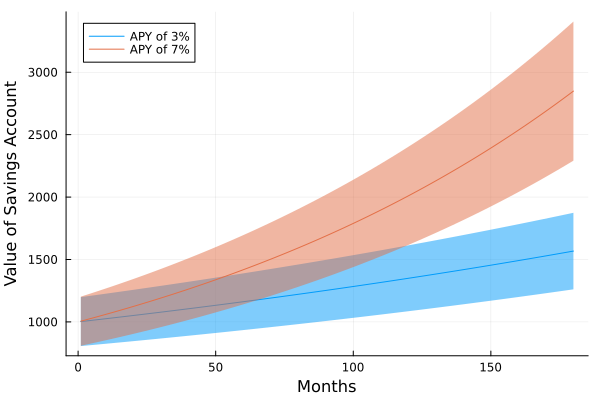
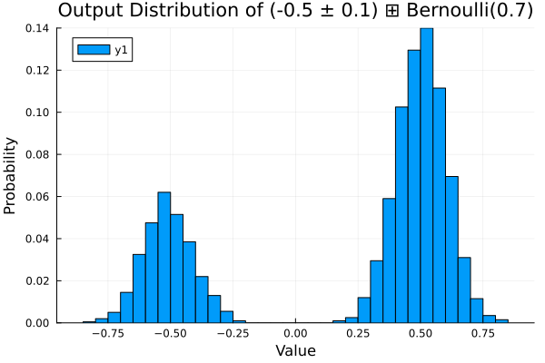

Modeling finances typically involves learning various heuristics and following them.
However, when it comes to choosing a risk tolerance, it's a little more black-and-white
than I am personally comfortable with (or at least, so is my understanding of those
heuristics).

While various financial planning tools exist, none of them fulfill the *je ne sais quoi*
of writing your own over-engineered particle-based simulations. For instance, you might
be in a situation where you are interested in understanding the difference between organic
account growth and risky investments, while having a good understanding of what your exposure
to the market is at a time where you are least solvent in your risk-taking era. Or you may be
interested in understanding the correlations between various different risky strategies, and how
these risks may compound.

The goal of this Julia package is to put quantitative numerical rigour to individual (and other)
investment accounts.

# Methods

## The Particles Method

When running a financial simulation, instead of using a typical numeric quantity, for instance
a `Float64`, we instead use a `Particle` as implemented in `MonteCarloMeasurements.jl` [\[1\]](#references). The name
particle follows from the [particle filtering](https://en.wikipedia.org/wiki/Particle_filter) literature.
A `Particle` object contains a set of particles ($O(1000)$ particles) that are used to represent distinct 
trajectories in a Monte Carlo simulation. These particles sample a probability distribution differently,
and as a result, can be combined after applying some computation $f$ on each trajectory (as you would on a 
float), to get an output probability distribution after performing $f$.

For instance, if $f$ is a linear map that preserves gaussians, say, $f(x)=x+2$, where we 
know $x\sim \mathscr{N}(0, 1)$ takes from a normal distribution, then we can calculate the PDF
of $f(x)$ which should be $\sim \mathscr{N}(2, 1)$. When the map is not linear and/or the probability
distribution being used isn't preserved under $f$, this gets much more complicated. This can be further
complicated in the presence of multiple variables where they could be correlated by different amounts.

This calculation is neat since each particle inside a `Particle` object is disjoint and can be parallelized
over (e.g. SIMD), which is what `MonteCarloMeasurements.jl` does [\[1\]](#references).

This type of simulation also lends particular usefulness when considering low probability events and
highly discontinuous or non-linear systems -- things a person might be interested in capturing when
investing their money.

## Implementation

A few classes exist in the package that model different types of investment accounts, these accounts
can be thought of as our functions $f$. A `SavingsAccount`, for instance, implements typical simple and
compound interest over some period of time. By starting a simulation of placing \$1,000 $\pm$ 100 into an account
we can see how the amount grows and how the uncertainty grows as a function of the time and yield.

```jl
sa = InvestmentAccounts.SavingsAccount(1000. ± 100., 0.03/12)
sa2 = InvestmentAccounts.SavingsAccount(1000. ± 100., 0.07/12)
dates = 1:15*12

ribbonplot(dates, InvestmentAccounts.calculate_time_dependent_total_value(sa, dates), label="APY of 3%")
ribbonplot!(dates, InvestmentAccounts.calculate_time_dependent_total_value(sa2, dates), label="APY of 7%")

xlabel!("Months")
ylabel!("Value of Savings Account")
```

<center>
<figure>
  
  <figcaption>
  Simulation of a \$1,000 $\pm$ 100 account growing over the span of 15 years with two different APYs with shaded
  regions siginfying the 0.025 quantiles.
  We can not only track the average growth of the two accounts, but also the error bars on our input estimate,
  showcasing the basic functionality of propagating a basic error model through a simple compound interest account.
  </figcaption>
</figure>
</center>

The `±` in the code above indicate a gaussian distribution, but one in principle is interested in distributions
beyond that. For instance, one could choose to model a higher-risk accounts return as bimodal, where you are
more likely to make or lose more money and the chance the account value is unchanged is small. For the purposes
of illustration, let's model this as a univariate biased coin flip + gaussian: `(-0.5 ± 0.1) ⊞ Bernoulli(0.7)`.

<center>
<figure>
  
  <figcaption>
  </figcaption>
</figure>
</center>


# References

1. https://baggepinnen.github.io/MonteCarloMeasurements.jl/stable/