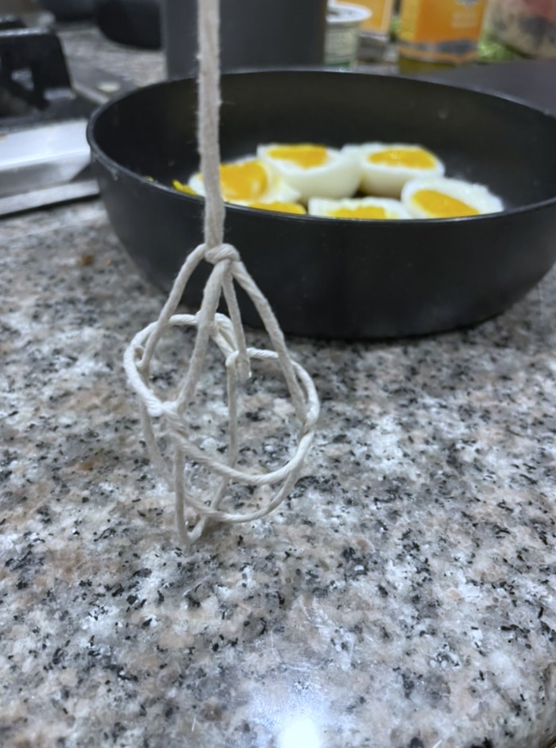

I came across the Nature paper "[Periodic cooking of eggs](https://www.nature.com/articles/s44172-024-00334-w#Sec9)" and as an appreciator of 
simulation-based culinary arts and jammy yolks -- found it interesting. By nature of having a full-time job, living in a house with friends
with regular house dinners we cook and many projects to tend to (like this one!), I can appreciate how weighting the time involved in cooking
an egg should be lumped into the definition of egg optimality. As a means to find my optimal eggs, I developed a 
[Julia FEM simulation](https://github.com/itstorque/pulsed-egg-cooking) to simulate thermal transport and gelation dynamics of an egg.
We can now treat this as an optimal control problem to find the optimal cooking methods for a desired egg profile.

<figure markdown="1">
   
   <figcaption>Picture of eggs cooked using 2 pulsed methods, each coulumn of eggs is labelled by a number. 
   Egg (1) Proposed faster pulsed cooking of eggs, (2) re-calibrated version of the original cooking sequence from the Nature paper and (3) a different cross-section
   of an egg cooked using the Nature paper method. Eggs (1) and (2) are qualitatively similar despite the $\times 2.7$ faster cook time.</figcaption>
</figure>

After chatting with my friend Rihn about the topic, they expressed their dissapointment
in the definition of optimality in this paper, as they personally prefer
a fully cooked yolk and slimey raw whites. While this seems challening at first, due to the
rise of different dominant egg-modes and the fact that the gelation activation energies of
the yolk and albumen are different, we find a simulation where this is possible.

Through-out this blog, we will have:
1. A derivation of the models required to simulate the dynamics of boiling an egg, as implemented in our repo [PulsedEggSimulations.jl](https://github.com/itstorque/PulsedEggSimulations.jl)
2. Simulations of egg temperatures and gelation from the [PulsedEggSimulations.jl](https://github.com/itstorque/PulsedEggSimulations.jl) repo
3. Experimental validation of those temperature profiles
   <ol type="a">
   <li>Reproducing the pulsed egg from the Nature paper</li>
   <li>A comparison with the new proposed faster pulsed cooking method</li>
   <li>A "cursed egg" showcasing raw whites and fully gelled yolks</li>
   </ol>
4. A robot arm that can be programmed with the desired temperature pulses to cook an egg optimally
5. A calibration method you can use after cooking a pulsed egg

<!-- Their joking aside, I got sucked into the question of how hard
would it be for one to cook the egg yolks completely while having
the egg whites still not undergo gelation. As an obvious first step,
I had to reproduce the simulations of Di Lorenzo et al. in Julia
and then search the parameter space for these cursed regimes where
we can get Rihn's optimal egg. -->

# The model

Instead of using a Computational Fluid Dynamics (CFD) tool 
like they did in the Di Lorenzo paper,
I will instead be writing my own Julia simulation using [`OrdinaryDiffEq.jl`](https://docs.sciml.ai/OrdinaryDiffEq/stable/).

In the simulations, we will be interested in the thermal transport problem as well as the gelation (turning from goopy liquid egg into a cooked egg) problem. We will be modelling the
egg as having a Dirichlet boundary condition along the shell (since water has a high heat capacity and is assumed to be sitting at that temperature before eggs are placed in).

The assumptions in the Di Lorenzo paper are as follows:
1. 

I will further introduce one more assumption, that the problem
is reducible to 1D. If the egg were a perfect sphere, then this
is a gauranteed assumption - the symmetry along the sphere and BC ensures that there should be minimal components along the theta and phi directions inside the sphere. However, since our egg is oval shaped (reflective but not rotational 
symmetry), this is not a gaurantee, as various oval egg modes
might begin to appear. 

{:.small_figure}

Given that we are already ignoring the presence of an air cell
within the egg, which will greatly effect the thermal modes of 
the egg and that in an actual egg, we experience convection,
assuming the problem is 1D will be an okay assumption to make.
Since we will assume that gelation is also independent of nearby portions having been gelated, we can imagine that in the steady state operation of the egg, a single 1D slice of an egg will
be an averager over the modes to get the simulated slice.

The 1D slice we take goes from one edge of the egg through the yolk and out to the other egg edge, 
where both edges (referred to as left and right) are held at a constant temperature using a Dirichlet
boundary condition. This temperature refers to the temperature that is pulsed between boiling and cooling
in the periodic cooking of eggs paper. Our pulsing follows hard transitions in temperature due to the fact
the eggs are removed and submerged into baths held at a different temperature - we assume that the accessible
heat energy in the water bath overwhelms that of the egg, and as such it's constant.

The Julia code takes into account different geometric and thermal parameters of the yolk and albumen. 
The heat equation being solved is:

$$\frac{\partial T}{\partial t} = \alpha \nabla^2 T + S(z)$$

Where the first term correspond to the typical thermal conduction model and the $S(z)$ allows us to
test various internal components for thermal generation. This can help us test other higher-dimensional
harmonics in the egg and what effect it may have on the egg (for instance, heat being injected from a 
slice above the one we took in). 

The thermal diffusivity coefficient, $\alpha$, is temperature and material dependent, and as such, 
we will need two different variants, $\alpha_{\mathrm{albumen}}$ and $\alpha_{\mathrm{yolk}}$ corresponding to the two consistuent egg "materials".
We will also add temperature dependence to them 
($\alpha_{\mathrm{albumen}}(T)$ and $\alpha_{\mathrm{yolk}}(T)$) from the data presented in [2]. This temperature dependence takes
the form of other measurables that were well-characterized:

$$\alpha_{i}(T_i) = \dfrac{k_i(T_i)}{c_i\rho_i(T_i)}$$

Where $i$ refers to a cross-section $i$ of the egg, which indicates the position and material (yolk or albumen). For example,
as the white heats up, the density of the whites change, and as a result, the thermal diffusivity also changes.

Defining the Laplacian operator in one dimension: 

$$\nabla^2 T = \frac{\partial^2 T}{\partial z^2}$$

We can then discretize it to get: 

$$\nabla^2 T_i = \frac{T_{i-1} - 2T_i + T_{i+1}}{\Delta z^2}$$

Finally translating this to an update function on the thermal state: 

$$T(t + \Delta t) = T(t) + \Delta t \left( \alpha \nabla^2 T + S(z) \right)$$

In the code, this is implemented using a `SplitODEProblem` that takes in a time evolving matrix $D(t)\sim D(\vec T)$ 
where $D(\vec T) = \vec\alpha(\vec T) \odot \nabla^2$ and a right hand side that sets the BCs and any other thermal inputs 
$S(z)$. The BCs are set as $\alpha_{\mathrm{albumen}}(T_{\mathrm{drive}})\cdot T_{\mathrm{drive}} / \Delta z^2$, and unless otherwise stated, $S(z)=0$.

For more details on the thermal properties and model, the reactivity equations used for gelation and the egg parameters, checkout the code in the [package repository](https://github.com/itstorque/PulsedEggSimulations.jl).

We will model done-ness (the process of having a node $i$ gone through gelation, $X_i(t) \in [0, 1]$) in a similar fashion to the paper
using the Arrhenius equation as they did in the paper:

$$ \frac{dX_i(t)}{dt} = A_i\cdot \exp\left(\frac{E_{a, i}}{R\cdot T_i(t)}\right) $$

Where $E_{a, i}$ is the activation energy for gelation for the node at 
$i$ (2 different values based on albumen or yolk) and similary $A_i$ for
the pre-exponential factor. 
$T_i(t)$ here is the temperature of node $i$ at a time $t$ from the thermal transport simulations
and $R$ is the universal gas constant. As the eggs cook, we expect this to go from $0$ to $1$, correpsonding
to how "done" the eggs are.

TODO: add note on how the two phases meet at 15mm

# Results

## Simulating "DC" Egg Cooking

Comparing the DC solution of the solver and paper, we see good agreement. Below is a julia simulated plot

<figure markdown="1">
   
   <figcaption>Simulation of hardboiling an egg at 100°C. The left plot is the temperature of different cross-sections of the egg. The right plot showcases the gelation/degree of cooking of the egg.</figcaption>
</figure>

<figure markdown="1">
   
   <figcaption>Simulation of hardboiling an egg at 100°C. Identical to hardboiling an egg, except for a shorter total cooking time.</figcaption>
</figure>

<figure markdown="1">
   
   <figcaption>Simulation of sous-vided egg at 65°C.</figcaption>
</figure>

## Pulsing the Egg

Reproducing the results from the Di Lorenzo paper:

<figure markdown="1">
   
   <figcaption></figcaption>
</figure>

This however, takes a lot of work swapping between two dishes for 32 minutes. In search of a method to speed this up, I resorted to running a simulation where the bath temperature is stepped between multiple fixed values, this in principle should help guage the discrepancy between yolk and white temperatures. By cooling down from 100°C to 50°C (instead of 20°C), we can
make the 2 egg phases match temperature before raising it to 100°C again.
To then further cook the yolk, we can use the swinging temperatures to
modulate the rate of cooking. The result below is showcased for a cook time of 10 minutes (and cool down of 2 minutes where it continues to cook), the temperature takes the following values $T_i \in [100\rm{°C}, 50\rm{°C}, 100\rm{°C}, 30\rm{°C}, 100\rm{°C}]$,
swapping between $i$ and $i+1$ every 2 minutes.

<figure markdown="1">
   
   <figcaption></figcaption>
</figure>

This seems to result in the same done-ness in a matter that is thrice as fast.

<figure markdown="1">
   
   <figcaption></figcaption>
</figure>

 

## The Cursed Egg

With all these simulations, we still haven't verified Rihn's desire for a 
cursed egg. While I found multiple regimes of pulsing the egg that give us the desired outcome, I resorted to using a slow
sinusoidal varying drive temperature as its easy to implement -- an analogue to changing the dial on the stovetop 
as a function of time. Here is the solution I found.

<figure markdown="1">
   
   <figcaption></figcaption>
</figure>

Notice how this egg has a fully cooked yolk while the whites are left pretty raw.

# Experimental Methods

## Experimental Setup
<figure markdown="1">
   
   <figcaption></figcaption>
</figure>

### Eggsperimental Subjects
The eggsperimental subjects were acquired by Sophia (thanks Sophia!). They were securely attached to our device via an egg harness, which consists of the carrier knot tied out of cotton string.

<figure markdown="1">
   
   <figcaption></figcaption>
</figure>

### Egg Movement Device - Eggjet2000

The Eggjet2000: changing eggsperimental design in a big way!

<figure markdown="1">
   
   <figcaption></figcaption>
</figure>

The Eggjet2000 is a motor powered robot arm providing an automated solution to moving the egg between water baths. It is controlled with an Arduino Uno.

The physical structure consists of a 20kg digital servo motor mounted on a vertical aluminum extrusion. This aluminum extrusions is screwed onto a flat base plate with a weight (a block of metal) resting on it to keep it stable. 

A bent aluminum bar attaches to the motor on one side and has a screw that the egg in its harness can be tied to. The bend in this bar provides enough clearance for the egg to move in front of the Eggjet2000 unhindered. 

<figure markdown="1">
   
   <figcaption></figcaption>
</figure>

### Water Baths & Temp Control

Two pots placed on either side of the Eggjet2000 contained the water baths. The length of the string was adjusted with enough slack so the egg can land lightly and randomly tilt to one side.

This experiemnt called for 2 water baths - one kept at boiling and another variable. The baths were monitored with two digital instant read thermometers. An electric kettle of hot water and ice cubes were kept handy to adjust temperatures.

<figure markdown="1">
   
   <figcaption></figcaption>
</figure>

The bath set to constantly boil on the stove and was measured to be 98C. A raiser with 3 legs was placed in this bath to prevent pot conduction from unevenly heating the egg.

<figure markdown="1">
   
   <figcaption></figcaption>
</figure>

<figure markdown="1">
   
   <figcaption></figcaption>
</figure>

A custom lid was also developed to decrease water loss due to evaporation and to maintain thermal energy while still allowing egg passage. This was constructed out of a cardboard circle with an egg-shaped portion cut and bent away to act as a handle for researchers and means of egress for the egg. It was then wrapped in aluminum foil. 

<figure markdown="1">
   
   <figcaption></figcaption>
</figure>

<figure markdown="1">
   
   <figcaption></figcaption>
</figure>

## Experimental Procedure

Arm Positions:
The Arduino Uno was programmed to move the robot arm in any position along an 180 degree arc. The hanging egg is submerged in one bath at the 0 degree position, waiting in the air above and between the water baths at the 90 degree position, and submerged in the other bath in the 180 degree position. The waiting in the air posistion for 5 seconds helps prevent cracking of the egg's shell due to quick thermal changes, and minimizes drips and temperature contamination between baths.

Timing and Temperatures:
For the Nature paper method, the arm was set to submerge the egg in each bath for 150 seconds, alternating between 98C and 28C.

For our optimal method, the eggs were submerged in the following baths for 180 seconds per bath: 30C, 97C, 52C, 97C, 30C, 97C, and a cooling 30C. This was done by swapping the vessel with the 30C bath for one containing a 52C bath. 

## Calibration

Typically, you might need to calibrate for different sizes of eggs, different environment conditions you are cooking in
or the hen laying the egg. We usually ignore calibrating for the hen as it's too granular, but given eggs from the same
source with roughly the same size, we can use a simple procedure to calibrate our model to the specific egg.

Since we care about the "AC" dynamics of egg cooking, we need to select an "AC" setting where the boundary conditions are
time-varying. This is analogous to probing an electrical circuit, where, typically probing a system with RF signals is more
useful for decoding a black-box object than probing the DC (zero frequency) components. We also want to have a controlled
setting, so we will calibrate it using only two stationary thermal baths with constant dwell times, for instance,
similar to the pulsing method laid out in the Di Lorenzo paper. 

After cooking an egg following some pulsing description between two thermal baths, we can setup a simulation with two baths
(calibrated to a measurement from the experiment using a thermometer with 0.1-1 $^{\circ}$C accuracy). The diameters of the 
yolk and white in the simulation can be determined from slicing the cooked egg in half, these dimension parameters will be
used as our calibrated diameters now. After running the simulation, we can tweak the `scaler` parameter in the simulation
to fine-tune the thermal properties of the egg that were left to be phenomenologically tuned. This includes factors like 
the thermal load of the water bath, perturbations on the white and yolk parameters from an ideal egg (e.g. how much moisture,
existence of an air-bubble, etc.) and taking into account thermal properties that are beyond our model (like the new modes
introduced by the deviation of the 3D geometry from the 1D approximation and the prevalance of convection currents within
the egg).

# Acknolwedgements

- **Rihn**: designed and led all the experimental work. Built various contraptions for the experimental validation.
- **Felipe & Rihn**: for building the robot arm ("The Egginator 2000") 
- **Anders Olsen, Boof, Wasabi, Lev, Sophia Diggs-Galligan, Felipe, Sar M.**: Thanks for the discussions on many details of the egg-related theory and experiments, being taste test subjects and for cheering as "The Egginator 2000" did its job.
- **Di Lorenzo and team**: the original work that inspired this blog-post, you managed to nerd-snipe me and many of my friends on this problem.

### Note on the safety of these experiments

By integrating the temperature as a function of time, we can model the log-reduction in populations of Salmonella and E. Coli [3].
Officials typically recommended to reduce the populations of both by 5-logs as a public safety standard [4]. Consumption of eggs should be conducted at your own
risk, non-hard-boiled eggs are always considered to hold some finite amount of risk, do your own research on the safety 
of boiling eggs.

- The cursed egg reduces the amount of Salmonela and E. Coli by 1-2 logs, this is not per-safety recommendations.
- The Di Lorenzo paper reduces the amount of Salmonela and E. Coli by more than 5 logs, this is considered safe for consumption.
- The fast procedure here - if calibrated properly - reduces the amounts of Salmonela by 4-5 logs and E. Coli by 5-6 logs. This is considered safe for consumption. This is safer than consuming a soft boiled egg.

# Referneces

1. [E. Di Lorenzo et al., Periodic cooking of eggs - Nature](https://www.nature.com/articles/s44172-024-00334-w)
2. [B. Abbasnezhad, Numerical modeling of heat transfer and pasteurizing value during thermal processing of intact egg](https://scholar.google.com/scholar_lookup?&title=Numerical%20modeling%20of%20heat%20transfer%20and%20pasteurizing%20value%20during%20thermal%20processing%20of%20intact%20egg&journal=Food%20Sci.%20Nutr.&doi=10.1002%2Ffsn3.257&volume=4&pages=42-49&publication_year=2016&author=Abbasnezhad%2CB&author=Hamdami%2CN&author=Monteau%2CJ-Y&author=Vatankhah%2CH)
3. salmonela+E Coli paper (TODO: add reference)
4. Safety for consumption E Coli (TODO: add reference)
