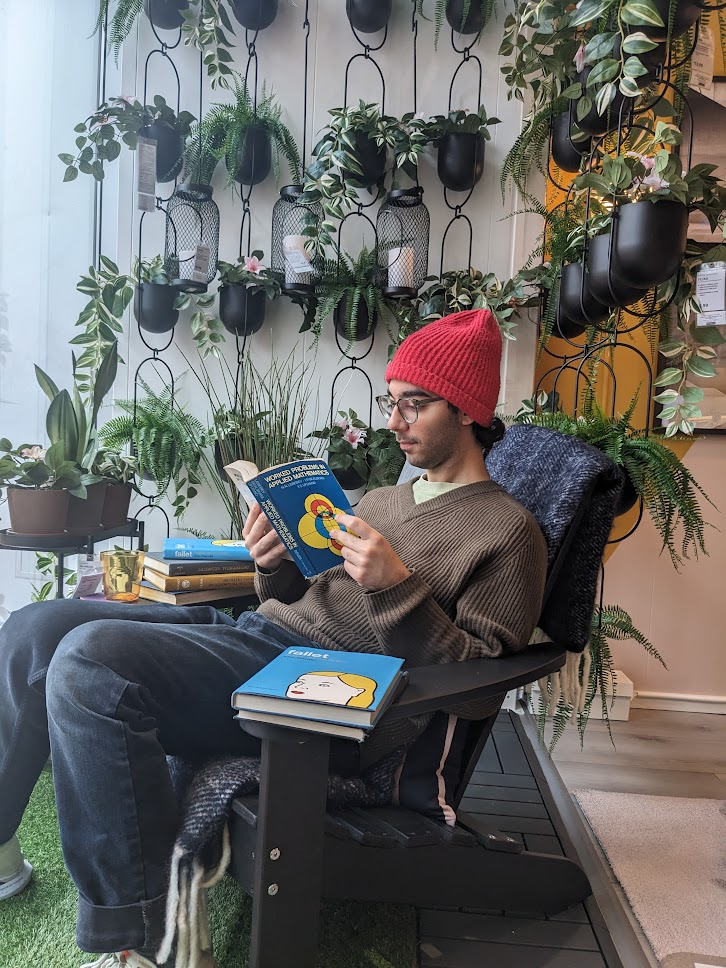

  

  

    <h1>👋</h1>
  

  

    <!-- this spacer is for phones, helps keep the correct spacing on top of the title after emoji-block jumps into menu icon -->
    <h1 style="opacity:0">o</h1>
  

  

    <h1>
      <b>"Hello! I'm</b> Tareq  Torque El Dandachi</h1>
  

Hey there! I go by Torque (<a onclick="playAudio()">🔉/tɔɹk/</a>)
and I am a masters student at MIT interested in hardware, superconducting electronics, computational photography and 
quantum computing. I enjoy reducing problems into math, designing devices and algorithms to be 
optimal and hacking functionality into existing
software.
Outside of my research, you can find me designing my own microcontroller, going on hikes or fangirling about 
julia.
{: .intro}

I also did my undergrad at MIT where I got to do
research on
diamond-based
quantum computing, made simulators for superconducting devices and developed
glasses
that filter out epileptic triggers with a team of product designers.
{: .intro}

  



### Check out my
{: .check_out_my}

  
<a href="https://itstorque.github.io/resume-2022/main.pdf">
  
  
Resume

  </a>

  
<a href="https://github.com/itstorque">
  
  
GitHub

  </a>

  
<a href="https://www.linkedin.com/in/torqued/">
  
  
LinkedIn

  </a>

{: #education.title_with_emoji}
## Education

#### Masters Degree

For my masters, I am leveraging mathematical methods to approach several different problems
when it comes to simulating, designing, fabricating and testing superconducting nanoelectronics.
These electronics are tiny and are cooled down below 4 Kelvin. Through their highly non-linear 
behaviour, we can design a range of cool devices including a single photon detector and a
single photon imager!

- I build efficient julia simulators for large-scale networks of non-linear superconducting devices. 
<!-- The goal is being able to simulate millions of devices, where the smallest deviceis thousands of LC elements in less than a minute! To do that, I spend a lot of time finding symmteries and exploiting them and utilizing cool methods such as harmonic balance for frequency domain precomputation. -->
- Build tools on top of existing simulators (like LTspice) that exploit them to give them new 
features and speed them up. See my project [spice-daemon](https://github.com/itstorque/spice-daemon).
- Designing a new optimal scheme to characterize fabrication defects in superconducting electronics.
- Apply various mathematical tools ranging from gradient descent to space filling curves to design better
devices.

#### Undergraduate Degree

I double majored at MIT graduating with a
B.S. in Electrical Engineering and Computer Science and a
B.S. in Mechanical Engineering and Quantum Information and Computation.

Over my time at MIT, I took a wide range of classes that cover quantum & information theory, quantum computing
platforms, theoretical computer science, FPGA design, processor design, semiconductor physics, image processing, controls, thermofluids, mechanics and product design.

<a id="toggle_class_list" class="changing" onclick="toggleClassList()">SHOW ALL CLASSES</a>

{: #class_list}
- Spring 2022
  - {: .meche-color} Measurement and Instrumentation
  - {: .cs-color} Computer Systems Security
  - {: .ee-color} Music Technology
  - {: .quantum-color} Quantum Complexity Theory
- Winter 2022
  - {: .ee-color} FPGA Design
  - {: .meche-color} Mechanical Engineering Tools
  - {: .cs-color} Battlecode: AI Player Strategies (listener)
- Fall 2021
  - {: .meche-color} Product Engineering Processes
  - {: .quantum-color} Quantum Measurement
  - {: .other-color} Technology and Culture
  - {: .math-color} Mathematical Methods in Nanophotonics (listener)
- Spring 2021
  - {: .quantum-color} Physics and Engineering of Superconducting Qubits
  - {: .math-color} Linear Algebra
  - {: .math-color} Probability and Random Variables
  - {: .ee-color} Digital Instrument Design
  - {: .other-color} Science in Action: Technologies and Controversies in Everyday Life
  - {: .cs-color} Advances in Computer Vision (listener)
- Fall 2020
  - {: .ee-color} Superconducting Classical and Quantum Circuits
  - {: .cs-color} Digital & Computational Photography
  - {: .math-color} Theory of Computation
  - {: .quantum-color} Quantum Computation
  - {: .other-color} Einstein, Oppenheimer, Feynman: Physics in the 20th Century
  - {: .ee-color} Solid-State Circuits (listener)
- Spring 2020
  - {: .ee-color} Microelectronic Devices and Circuits
  - {: .meche-color} Dynamics and Control
  - {: .cs-color} Robotics: Science and Systems
  - {: .math-color} Automata, Computability, and Complexity
  - {: .meche-color} Thermal-Fluids Engineering
  - {: .cs-color} Numerical Computation
  - {: .other-color} Introductory Biology
  - {: .other-color} Archaeological Science
- Winter 2020
  - {: .quantum-color} Introduction to Quantum Computation
  - {: .cs-color} WebLab: Web Programming
  - {: .ee-color} Mobile Autonomous Systems Lab
- Fall 2019
  - {: .ee-color} Computation Structures
  - {: .cs-color} Artificial Intelligence
  - {: .meche-color} Mechanics & Materials
  - {: .meche-color} Introduction to Design
  - {: .other-color} Introduction to Linguistics
- Spring 2019
  - {: .math-color} Differential Equations
  - {: .math-color} Information, Entropy and Computation
  - {: .ee-color} Circuits and Electronics
  - {: .ee-color} Introduction to Medical Technology
  - {: .cs-color} Fundamentals of Programming
- Fall 2019
  - {: .math-color} Multivariable Calculus
  - {: .quantum-color} Electricity and Magnetism
  - {: .quantum-color} Programming the Universe
  - {: .other-color} Bioethics
  - {: .other-color} Introduction to Solid-State Chemistry

{: #teaching.title_with_emoji}
## Teaching Experience

I also got the chance to help out with courses over my time at MIT.

#### Mentoring 2.00b - Toy Design

I am currently mentoring MIT's Mechanical Engineering departments Toy Design class. In the class
students have to design and build toys using shop tools, circuits and microcontrollers.
{: .sectionHide.sectionTeaching}

#### LA-ing 6.004 - Computation Structures

I was an LA for "Computation Structures." The class covers assembly and the RISC-V processor architecture, the labs include HDL and assembly code where students get to build their own
RISC-V processor and run algorithms on it.
As an LA, I worked on testing labs and the backbones of the processor. I also helped teach students concepts
such as processor cycles and timing, combinatoric and sequential logic, memory hierarchy, processor pipelining and processor design tradeoffs.
{: .sectionHide.sectionTeaching}

#### LA-ing 6.002 - Circuits and Electronics

I was a lab assistant for "Circuits and Electronics" where I got the chance to help students understand circuit analysis, op-amp applications, and transistors. As a lab assistant, testing out labs, debugging circuits, helping students understand concepts taught in class and giving them check-offs as they worked in lab were part of my duties.
{: .sectionHide.sectionTeaching}

#### Teaching MIT ESP class - Making Code Hard(ly Work)

I also got the chance to teach a programming class to high schoolers with my friend Savoldy
in MIT's Educational Studies Program in a class we called (excuse the pun) "[Making Code Hard(ly Work)](https://github.com/itstorque/MIT-Splash-2019-Making-Code-Hardly-Work)."
In the class we teach good programming practices by showing them bad meme-y code, interesting debug problems that arise from poorly structured code,
and exercises where they get to write their own bad code.
{: .sectionHide.sectionTeaching}



{: #research.title_with_emoji}
## Research

 As an undergrad, I was also involved in research in two of MIT's quantum research groups: 
The
[Quantum Photonics Group (QPG)](https://www.rle.mit.edu/qp/)
and The
[Quantum Nanostructures and Nanofabrication (QNN)](https://www.rle.mit.edu/qnn).
I worked on 3 different research projects:

#### *QuantumClifford.jl* GPU Kernel Development

Implementing fast GPU quantum stabilizer formalism simulations for a Julia
quantum simulation package [*QuantumClifford.jl*](https://github.com/Krastanov/QuantumClifford.jl)
{: .sectionHide.sectionResearch}

#### Multiplexed optimal control of spin quantum memories

I worked on generating optimal microwave control pulses for diamond-based quantum computers. I developed models to simulate arbitrary arrangements of color centers and driving wire placement. Then applied optimal control theory techniques to find optimal time-varying pulses that improve the number of qubits that along with the other methods in the paper for the control of thousands of spins.
{: .sectionHide.sectionResearch}

#### Electro-Thermal Modeling of Superconducting Materials

At QNN, I developed mathematical methods and implemented an electro-thermal model
in Python to efficiently simulate superconducting wires and superconducting
nanowire single photon detector (SNSPDs). This is typically a hard problem since
these devices are highly non-linear and solving both the thermal and electrical
parts of a model is very complex - let alone making it fast.
{: .sectionHide.sectionResearch}



<!-- ### Quantum Julia -->

### Select Publications





{{ pub }}



{: #projects.title_with_emoji}
## Projects
 

### Highlighted Projects







{{ project | markdownify }}





<!-- #### RISC V processor

#### Custom Dev Board -->

<!--

#### qasm circuit preview

#### qasm syntax highlighter

#### jekyll themes

#### iOS Security research

#### rrg website

#### QuickTime VNC

#### LIDAR PID sim

#### quackman

#### qupong

#### MASLAB? -->

 

### A collection of other random projects

- [performer](https://github.com/itstorque/performer): Music, Instrument and MIDI synthesis tool in python. Supposed to be a python replacement for Max/MSP and puredata.
- [ltspice-tikz](https://github.com/itstorque/ltspice-tikz): A one-night project to convert LTspice circuit and symbol files into LaTeX pgp/tikz code. Hopefully people have no excuses to publish ugly looking circuits now.
- [spice-daemon](https://github.com/itstorque/spice-daemon): A toolkit that spawns alongside LTspice and adds functionality on top of LTspice. It can adds true noise generation, solve diff. eq.'s and adds a new level of parametrization not available in LTspice through python. Designed to suit the needs of people in my lab.
- [RCSJ-Washboard-Potential](https://github.com/itstorque/RCSJ-Washboard-Potential): A MATLAB visualization of washboard potentials you get by solving the RCSJ differential equation.
- [cookie-hijacker-chrome](https://github.com/itstorque/cookie-hijacker-chrome): A weekend project with a friend to develop a malicious chrome extension that steals a users cookies and passwords.
- [jekyll-shell-theme](https://github.com/itstorque/jekyll-shell-theme): A weekend project that makes jekyll webpages look like a shell. 
- [dumb-anyconnect](https://github.com/itstorque/dumb-anyconnect): A tweak that hooks into the Cisco AnyConnect app and adds a connection to the iOS keychain. A one-night project born out of the frustration of hacing to type my password everytime I want to use a VPN.
- [assistivetech.mit.edu](https://github.com/itstorque/assistivetech.mit.edu): A PHP website written from scratch for MIT's assistive technology hackathon with a hacker management backend.
- [QuickTimeVNC](https://github.com/itstorque/QuickTimeVNC): A python script that allows VNC like control of a jailbroken iPhone over QuickTime.
- [BetterCCBattery](https://github.com/itstorque/BetterCCBattery) and [OrientationControl](https://github.com/itstorque/OrientationControl): iOS tweaks that modify the user experience with the control center and orientation lock.
- [2086-WallFollower](https://github.com/itstorque/2086-WallFollower): A PID controlled robot simulator with visualization written in MATLAB.
- [quhackman](https://github.com/itstorque/quhackman): A quantum twist on pacman written in python and uses the IBM qiskit backend.
- [Turing-Machine-Simulator](https://github.com/itstorque/Turing-Machine-Simulator): A one-night project to simulate a turing machine tape in python.
- [rrg.mit.edu](https://github.com/itstorque/mit-rrg): I was hired to make a website for MIT ESI's Rapid Response Group.
